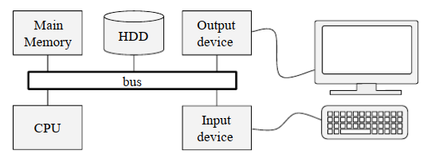
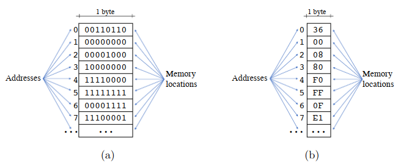
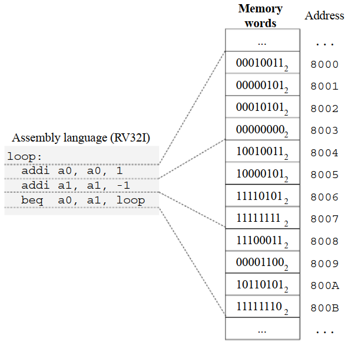

计算机程序有几种编码方式。例如，有些程序使用抽象指令集（abstract instruction sets  ）进行编码，并由模拟器或虚拟机执行。模拟器或虚拟机也是一个程序，它们是设计用来解释和执行抽象指令集的。Bash脚本、Java字节码程序和Python脚本，是使用抽象指令集编码的常见例子，需要模拟器或虚拟机来支持它们的执行。

原生程序（native program  ）是一种使用指令编码的程序，这些指令能够直接被计算机硬件执行，无需借助模拟器或虚拟机。在本书中，我们将重点讨论原生程序。因此，从现在起，无论何时我们使用“程序”这个词，除非另有说明，否则，我们指的是原生程序。

原生程序指令通常执行简单的操作，如对两个数字进行相加或者比较。但是，通过执行多个简单的指令，计算机能够解决复杂问题。

大多数现代计算机都是用数字电路制造的。这些机器通常使用映射到两种状态的电压水平（voltage levels  ）来表示信息。这两种状态可以是HIGH/LOW，或者是0/1 。因此，现代计算机的基本信息单位是一个二进制数字：1或0。因此，计算机上信息和指令被编码为二进制数字序列，或者说是位（bits）的序列。

# 1.1 计算机的主要组件

计算器通常由以下主要组件构成

* **主存（Main memory  ）**：主存用于存储正在执行的程序的指令和数据。主存通常是不稳定的，因此，如果计算机被关闭，它的内容就会丢失。

  

* **中央处理器（Central Processing Unit  ）**：CPU负责执行程序，它从主存中获取程序的指令并执行。在执行指令期间，它经常会从主存中读写数据。

  

* **持久化存储器（Persistent storage  ）**：由于主存是不稳定的，通常有一个持久存储设备来在断电时保存程序和数据。硬盘驱动器(HDD)、固态硬盘(SSD)和闪存驱动器都是持久存储设备的例子。

  

* **外围设备（Peripherals  ）**：外设是连接到计算器的输入/输出设备，例如显卡、USB控制器、网卡等。

  

* **总线（Bus）**：总线是在计算机组件之间传输信息的通信系统。这种系统通常由负责传输信息的线路（wires ）和协调通信的相关电路（associated circuitries  ）组成。

图1.1展示了一个计算机系统，该系统的主存、CPU、持久化存储设备（HDD）和两个I/O设备通过系统总线连接起来。    


  

`图1.1 计算机系统中的组件通过一个系统总线相连`

## 1.1.1 主存

计算机主存是用来存储程序指令和数据的存储设备，它由一组*字*<sup>[1]</sup>（memory words ）组成。每个*字*能够存储一组位(通常是8位)，并由一个唯一的数字标识，该数字被称为*字地址*（memory word address）。

字节可寻址内存（byte addressable memory  ）是一种内存，其中的每个*字*（此时又称为memory location）存储一个byte<sup>[2]</sup>，并与一个唯一的地址相关联。图1.2说明了字节可寻址内存的组织方式。可以看到，由地址5标识的*字*包含了值 $11111111_2$，而位于地址为0的*字*则包含了值 $00110110_2$  

    

`图1.2 字节可寻址内存的组织方式，（a）是2进制方式显示，（b）是16进制方式显示`


>  [1] 本文直接将memory words翻译为“字”，而不是直译为“内存字”，这样显得更为简洁
>
>  [2] 原文中没有直接定义byte，按照约定俗成，一个byte就是8个bit。
>
>  [3] 请注意区分字（memory words ）、byte，内存地址3个不同的概念。其中memory words又称为memory location。

## 1.1.2 CPU

中央处理单元是负责执行计算机程序的组件。 有多种实现和组织 CPU 的方法，但是，要了解程序如何执行，只需知道 CPU 包含：

* 寄存器（Register）：CPU 寄存器是位于 CPU 内部的小型存储设备。CPU 通常包含一小组寄存器。 例如，RISC-V 处理器包含 31 个 32 位寄存器，程序可以使用这些寄存器来在 CPU 内部存储信息。 计算机通常包含将值从主存储器复制到 CPU 寄存器的指令（称为“加载”指令），以及将值从 CPU 寄存器复制到主存储器的指令（称为“存储”指令）。
* 数据通路（A datapath）：CPU数据路径负责对数据执行操作，例如算术和逻辑操作。数据通路通常使用来自CPU寄存器的数据执行操作，并将结果存储在CPU寄存器上。
* 控制单元（A controller unit）：控制单元是负责协调计算机操作的单元。它能够通过总线发送命令来控制数据路径和其他组件，如主内存。例如，它可以向数据路径和主内存发送一系列命令，以编排程序指令的执行。

> **数据通路**是执行单元的集合，例如执行数据处理操作的[算术逻辑单元](https://zh.wikipedia.org/wiki/算术逻辑单元)、[乘法器](https://zh.wikipedia.org/wiki/乘法器)、[寄存器](https://zh.wikipedia.org/wiki/寄存器)和[总线](https://zh.wikipedia.org/wiki/总线)。它与[控制单元](https://zh.wikipedia.org/wiki/控制单元)一起组成[中央处理器](https://zh.wikipedia.org/wiki/中央处理器)（CPU）


访问寄存器上的数据比访问主存上的数据快得多。因此，程序倾向于将数据从内存复制到CPU寄存器中以实现更快的处理。一旦数据不再需要，可以丢弃或存回主内存中以释放CPU寄存器。

指令集体系结构(ISA)定义了计算机指令集，包括但不限于指令的行为、编码和可以被指令访问的资源，如CPU寄存器。一个为特定ISA生成的程序，可以被兼容该ISA的计算机执行。

ISA往往随着时间的推移而演变，然而ISA设计者试图保持新版本的ISA与以前的版本兼容，以便遗留代码（即为旧版ISA生成的代码）仍然可以由更新的CPU执行。例如：为80386 ISA生成的程序可以被任何实现或兼容该ISA的处理器执行，如80486 ISA。


# 1.2 执行程序指令

如前所述，现代计算机通常在主内存中存储正在被执行的程序，包括它的指令和数据。CPU从主内存中获取程序的指令来执行。另外，当执行
指令时，CPU可往主存中读写数据。为了说明这个过程我们将考虑一个实现RV32I ISA的CPU。

RV32I ISA规定指令使用32位编码。因此，假设系统有一个字节可寻址内存，则每个指令占用4个字。此外，它规定指令按照它们在主存中出现的顺序执行。

我们考虑一个为RV32I ISA生成的小程序，由3条指令组成，在主存中地址为8000的地方开始存储。因为每一指令占用4个字节(即32位)，且指令是连续存储在主存上，所以第1条指令位于地址8000、8001、8002和8003，第2条指令位于地址8004、8005、8006和8007，第3条指令位于地址8008、8009、800A和800B。图1.3展示了存储在主存中的指令。  

​    

`图1.3 3条RV32I指令在主存中地址为8000的地方开始存储`


CPU通常包含一个寄存器来跟踪下一条需要被执行指令。在RV32上这个寄存器称为程序计数器（Program Counter  ）或PC，它存储了下一条要被执行的指令的内存地址。例如，在图1.3所示的代码中，在执行的第一个指令之前，PC的值为8000。一旦位于地址8000的指令被获取了，PC中的值就增加4，一旦当前指令完成了，则下一条指令(位于地址8004)就能被获取执行。算法1演示了一个简单的RV32I CPU的执行周期。

* 首先，CPU根据PC中的地址，从主存中获取一条指令并将其存储在一个叫做IR的内部寄存器中，该指令由4个字（32bit）组成。

* 然后，它更新PC，使其指向内存中的下一条指令。

* 最后，它执行获取到的指令。

请注意，在执行指令时，CPU也可能访问主存来读写数据。

```assembly
# 算法1：RV32I指令的执行周期

while True do
# Fetch instruction and update PC ;
	IR ← MainMemory[PC] ;
	PC ← PC+4;
	ExecuteInstruction(IR);
end	
```

为了执行一个程序，操作系统本质上是将程序加载到主内存中(例如，从一个持久存储设备)，并将PC设置为指向程序入口点

# 1.3 启动过程