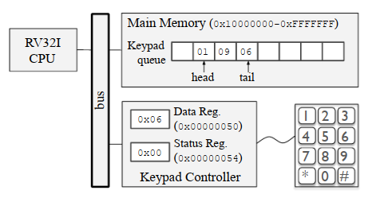
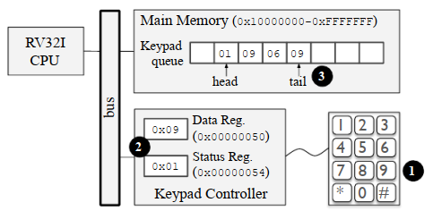
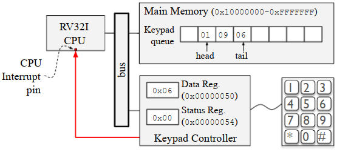
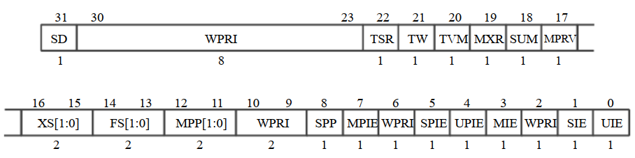

# 10.1 简介
如前几章所述，CPU从主存中获取指令并执行。在这种情况下，系统（注意，这里强调的是系统，不是CPU）中发生的大多数操作都是由CPU发起的，这些操作都是CPU指令执行的结果。例如，在主存和外设之间读写数据是由CPU在执行指令时触发的事件。但有些事件是由其他硬件（如外设）发起的。例如在9.4节讨论的系统中，当按下一个小键盘的键时，小键盘控制器将该信息记录到小键盘控制器寄存器上。即使事件不是由CPU发起的，它也可能需要CPU的关注，例如它可能需要CPU执行一些操作。因此，必须有一种方法来通知CPU有一些外设需要它的关注。  
为了说明这个概念，让我们考虑图10.1所示的计算系统，它包含一个RV32I CPU、主存和一个小键盘。  

  
> 图10.1

小键盘连接到小键盘控制器，该控制器包含两个8位寄存器：Data寄存器和Status寄存器。映射到地址0x00000050的Data寄存器存储了一个值，表示键盘上按下的最后一个键。映射到地址0x00000054的Status寄存器包含一个值，表示键盘的当前状态。状态寄存器的最低有效位（第0位那个bit），称为就绪位（READY bit），表示CPU上次从Data寄存器读取值后是否按下了键盘。如果它的值是0，意味着自上次CPU从Data寄存器读取值以来，没有按下任何键，否则，它的值是1。状态寄存器的第二个最低有效位（第1位那个bit），称为OVRN位，表示自从CPU上一次从Data寄存器读取值以来，键盘是否被多次按下。如果它的值是1，则意味着自上次CPU从Data寄存器读取值以来，键盘被按了不止一次。由于小键盘控制器只包含一个Data寄存器，如果在CPU获得读取Data寄存器的机会之前多次按下小键盘，一个或多个的按键值会丢失。这种情况称为OVRN (overrun，数据溢出)，可以通过检查Status寄存器的OVRN位来检测。  

程序读取Data寄存器内容的时间越长，数据溢出的可能性就越高。为防止数据溢出，按下键盘后，通常将Data寄存器的值复制到位于主存中的先进先出（FIFO）队列。这种方法如图10.2所示，它使用一个长度为8的循环缓冲区和两个指针实现了FIFO队列，一个指向队列头（插入的最老元素），另一个指向队列尾（插入的最后一个元素）。在这个例子中，按键1、9和6被按下并存储在队列中。

  
> 图10.2

在这种方法中，每当按下一个键时，它的值就会被推送到队列的尾部，而每当用户程序需要读取一个键值时，它就会从队列的头部弹出该键，而不是从键盘Data寄存器读取。注意，队列作为缓冲区能够存储多个键值，允许程序在读取每个键值之前执行较长的计算。图10.3说明了按下键盘键9时会发生什么。
* 首先，按下了键9。①
* 然后，键盘控制器在Data和Status寄存器上记录该信息。②
* 最后，CPU执行一个例程，将Data寄存器的值推送到队列尾部。③

  
> 图10.3

将值从键盘的Data寄存器复制到位于主存的队列通常是由CPU通过执行例程来实现的。在这种情况下，每当键被按下时，CPU必须尽快执行该例程，以防止数据溢出。有两种主要方法可以通知CPU去处理由外部硬件引起的事件：轮询和硬件中断。

## 10.1.1 轮询
轮询是一种程序设计方法，让CPU周期性地检查是否需要处理外设的信号。在这种方法中，程序被设计成随时检查可能需要CPU介入的外设。例如，程序可能包含一个主循环，反复检查外设并执行一些计算。每当有一个外设需要处理时，程序都会调用一个例程来处理这个外设。算法3演示了一个使用轮询来处理外设的程序。它由一个主循环（`while`循环）组成，该循环检查外设以是否需要处理，并交替执行一些计算。

```Pascal
while True do
    // 处理外设
    for p in Peripherals do
        if needsAttention(p) then
            handlePeripheral(p);
        end
    end
    PerformSomeComputation();
end
```
> 算法3：使用轮训处理外设

算法4演示了使用轮询来定期检查和处理键盘的代码。在这个例子中，`keypadPressed()`函数检查键盘就绪位是否设置，如果设置则返回true，然后程序调用`getKey()`和`pushKeyOnQueue()`例程读取数据寄存器的内容，并将其推送到队列的尾部。`Compute()`例程表示程序在这段时间内完成的工作。

```Pascal
while True do
    if keypadPressed() then
        k ← getKey();
        pushKeyOnQueue(k);
    end
    Compute();
end
```
> 算法4：使用轮训处理小键盘

请注意，`Compute()`例程执行的工作量会影响检查键盘的频率。一方面，`Compute()`例程执行的时间越长，发生数据溢出的可能性就越高。另一方面，中断`Compute()`的计算会使每次对它的调用执行变快（例如，每次调用只执行一小部分计算），但可能会导致巨大的开销（检查外设可能需要很长时间），并且可能使程序难以设计和实现。因此，轮询通常不是检查和处理外设事件的最佳方法。

# 10.2 外部中断
**硬件中断（Hardware interrupt）是一种机制，允许硬件通知CPU它们（有事情）需要（CPU）处理。而外部中断是由外部（非CPU）硬件（如外设）引起的中断，通知CPU它们需要处理。** 在这种方法中，外设向CPU发送一个中断信号，一旦CPU接收到这个信号，它就会：
* 保存当前程序的上下文信息
* 调用例程去处理硬件中断
* 恢复被保存的上下文信息然后继续执行程序

为了说明这个概念，让我们考虑图10.4所示的计算系统。 

  
> 图10.4

这个系统与图10.1/10.2/10.3非常相似。主要的区别是CPU包含一个中断引脚，键盘控制器连接到该引脚（红色箭头）。**中断引脚是一个输入引脚，通知CPU是否有外部中断**。每当按键被按下时，键盘控制器通过中断引脚向CPU发送一个信号。CPU硬件不断地监视中断引脚，如果它接收到中断信号，它就中断当前的执行流来执行中断服务程序。**中断服务程序（ISR）是处理中断的软件例程**。有几种实现ISR的方法，但一般来说，它们通常将正在执行的程序的上下文（例如，CPU寄存器的内容）保存在主存上，与发送中断信号的外设交互，最后恢复保存的上下文，以便CPU继续执行被中断的程序。


## 10.2.1  检测外部中断
1.2节中介绍的CPU指令执行周期，算法5对该执行周期进行调整以便检测外部中断。在本例中，在获取执行指令之前，它会验证`interrupt_pin`是否被设置了，当CPU收到了中断且开启了中断检测这个变量才会被修改。即`interrupts -enabled`被设置了。如果两个条件都满足，它就将PC寄存器的值保存到`SAVED_PC`中，然后将PC寄存器的值设为中断服务程序（ISR）的地址，并通过清除中断启用寄存器来禁用中断。这些都完成后，下一条获取执行的指令是中断服务程序的第一条指令。

```pascal
while True do
    // 检查中断是否发生
    if (interrupt_pin = '1') and (interrupts_enabled = '1') then
        // 如果发生了且中断检测开启，则调用ISR
        SAVED_PC ← PC ;
        PC ← ISR_ADDRESS;
        interrupts_enabled ← '0';
    end
    // 获取指令并更新PC寄存器
    IR ← MainMemory[PC] ;
    PC ← PC+4;
    ExecuteInstruction(IR);
end
```
> 算法5

注意，算法5中的伪代码在调用ISR时禁用中断。这样做是为了在CPU重定向执行流以处理新的中断之前，ISR有机会保存所有重要的上下文（包括`SAVED_PC`的值）。此外，在某些系统中，ISR负责与外设交互，因此它停止（其它设备）向中断引脚发送信号。此时，CPU必须忽略`interrupt_pin`，~~直到外设停止向中断引脚发出信号~~（译注：这句不好理解，疑似有误）。一旦可以处理新的中断了，ISR会设置`interrupts_enabled`，这样CPU可以处理新的中断了。
> 注：CPU通常在上电时禁用中断，以便引导软件可以配置硬件并注册适当的ISR，等初始化ISR完毕之后才会处理中断。


## 10.2.2  调用适当的中断服务例程

一个计算系统可能包含几个外设，这些外设可能会中断CPU。此外，每个外设通常需要一个专门的ISR来处理其中断。例如，键盘控制器可能需要一个将Data寄存器中的值添加到主存队列的ISR，而指向设备（鼠标）控制器可能需要另一个操作。因此，每当中断发生时，系统必须执行两个任务：
1. 确定是哪个外设中断了CPU
2. 调用适当的ISR处理该中断

根据系统体系结构的不同，这两项任务可以由硬件、软件或两者结合来执行。实际上，有几种方法可以用来判断，哪个外设中断了CPU然后调用适当的ISR来处理中断。为了讨论主要的权衡，我们将考虑三种不同的设计：
* SW-only（software-only）
* SW/HW
* HW-only（hardware-only）

**SW-only**  
在SW-only中，ISR负责识别中断CPU的外设，并调用适当的例程来处理中断。在这种方法中，在中断发生时，CPU调用一个通用的ISR，该ISR必须执行这两项任务。由于没有硬件支持来确定是哪个外设中断了CPU， ISR可能必须与所有外设交互，以确定需要CPU关注的外设。一旦ISR发现哪个外设中断了CPU，它就可以调用适当的中断服务程序来处理外设中断。（译注：这种方法中，ISR可能需要轮询外设）

这种方法的主要优点是它简化了CPU硬件设计，这通常是一个重要的目标，因为硬件bug很难找到，而且一旦CPU制造和销售就不容易修补。尽管如此，如果有多个外设、或外设运行速度慢，ISR可能需要很长时间才能弄清楚是哪个外设中断了CPU。这可能会影响整体系统性能，甚至如前面几节所讨论的那样，可能导致系统由于overruns而丢失数据。


**SW/HW**  
在SW-HW中，ISR也负责执行这两项任务；但硬件提供了一些支持，（协助ISR）识别中断CPU的外设。在这种情况下，在中断发生时，硬件将寄存器的值设为某个值，该值表示哪个外设产生了中断。因此，ISR只需读取该寄存器，就能找出是哪个外设产生了中断。一旦ISR发现哪个外设中断了CPU，它就可以调用适当的中断服务程序来处理外设中断。

（在这种方式中）CPU的硬件设计可能不如SW-only那么简单；但这种方法中ISR花费很少的时间（通常是执行一两个指令所需的时间）来确定哪个外设发送中断信号。


**HW-only**  
在HW-only中，硬件负责识别中断CPU的外设，并调用适当的ISR。在这种情况下，每个外设都关联一个中断id，CPU必须自动将该id映射到各自的ISR。这通常通过一张表（称为中断向量表）来完成，该表将中断id映射到ISR的地址。


为说明这个概念，我们考虑这样一个系统，其中每个外设都关联到一个惟一的中断id，范围从0到15，每当接收到中断信号时，CPU都会自动将中断id注册到`INTERRUPT_ID`寄存器。此外，主存上有一个数组，称为中断向量表，它的下标为i的元素中包含了一个ISR的地址，而这个ISR就是与中断id为i的外设服务的。系统还包含一个名为`INT_TABLE_BASE`的寄存器，存储了中断向量表的地址。在这种情况下，为调用正确的ISR， CPU可以使用中断id从中断向量表加载ISR地址。算法6说明了CPU如何从中断向量表自动加载正确的ISR的地址。CPU将`INTERRUPT ID`寄存器的值乘以4，因为中断向量表中的每一项都是一个32位（4字节）的地址。

开机后，在启用中断之前，引导软件必须初始化内存中的中断向量表，并将中断向量表的地址写到`INT_TABLE_BASE`寄存器中。

这种方法的主要优点是性能好，因为CPU在中断发生时直接调用ISR。但CPU的硬件设计就变得更加复杂。


```pascal
while True do
    // 检查中断
    if (interrupt pin = '1') and (interrupts enabled = '1') then
        // 保存PC寄存器的值
        SAVED_PC ← PC ;
        //从中断向量表中获取ISR的地址，并设置PC寄存器
        PC ← MainMemory[INT TABLE BASE + INTERRUPT ID × 4];
        interrupts_enabled ← '0' ;
    end
    // 获取指令并更新PC寄存器
    IR ← MainMemory[PC] ;
    PC ← PC+4;
    ExecuteInstruction(IR);
end
```
> 算法6：CPU指令执行周期内自动调用适当的ISR  


# 10.3 RV32I上的中断
在本节中，我们将讨论RISV-V CPU的外部中断。我们将在11.1节中讨论RISC-V指令集体系结构定义了三个特权级别：
* 用户/应用模式
* 监督（Supervisor）
* 机器（Machine）

此外，它还规定微处理器可以只实现这些特权级别的一个子集。为简化讨论，本章将重点讨论只实现机器特权级别的系统，这通常是嵌入式系统的情景。第11章将讨论其他特权级别，以及它们对RISC-V中断处理机制的影响。


## 10.3.1 控制与状态寄存器
RISC-V控制和状态寄存器（CSR）是特殊的寄存器，它向软件公开CPU状态，并允许软件配置CPU行为。例如在RV32I ISA上，`mstatus`是一个32位CSR，其中包含几个暴露CPU当前状态或控制CPU行为的bit。

RISC-V ISA包含一组特殊的指令，使软件能够读取和修改CSR的值。

* `csrrw rd, csr, rs1`指令以原子方式交换CSR和普通寄存器中的值。例如`csrrw a0, mscratch, a0`指令会原子交换`a0`寄存器和`mscratch`CSR的内容。
* `csrr rd, csr`指令将`csr`这个CSR的的值复制到`rd`通用寄存器中。例如`csrr a0, mstatus`指令会复制`mstatus`这个CSR的值到`a0`寄存器。
* `csrw csr, rd `指令将`rd`通用寄存器的内容复制到`csr`这个CSR中。例如`csrw mtvec, a1`指令会复制`a1`寄存器的值到`mtvec` CSR中。

RV32I的CSR都是32位的，其中一些可能包含用于不同目的的子字段。例如`mstatus` CSR（如图10.5所示）包含超过17个子字段（例如`MIE`、`MPIE`等），每个都有特定的用途。

在后续的讨论中，我们将使用`csr.FIELD`来表示`csr`中的子字段`FIELD`。例如`mstatus.MIE`是指`mstatus`这个CSR中的子字段`MIE`。

  
> 图10.5

## 10.3.2 中断相关的控制与状态寄存器

## 10.3.3 中断处理流程

## 10.3.4 实现一个中断服务例程

## 10.3.5 初始化中断处理机制

