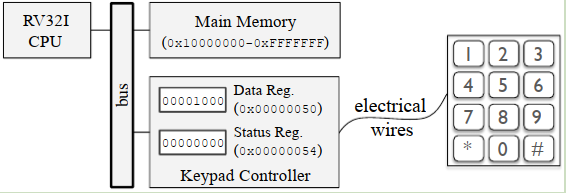

# 10.1 简介
如前几章所述，CPU从主存中获取指令并执行。在这种情况下，系统（注意，这里强调的是系统，不是CPU）中发生的大多数操作都是由CPU发起的，这些操作都是CPU指令执行的结果。例如，在主存和外设之间读写数据是由CPU在执行指令时触发的事件。但有些事件是由其他硬件（如外设）发起的。例如在9.4节讨论的系统中，当按下一个小键盘的键时，小键盘控制器将该信息记录到小键盘控制器寄存器上。即使事件不是由CPU发起的，它也可能需要CPU的关注，例如它可能需要CPU执行一些操作。因此，必须有一种方法来通知CPU有一些外设需要它的关注。  
为了说明这个概念，让我们考虑图10.1所示的计算系统，它包含一个RV32I CPU、主存和一个小键盘。  

  
> 图10.1

小键盘连接到小键盘控制器，该控制器包含两个8位寄存器：Data寄存器和Status寄存器。映射到地址0x00000050的Data寄存器存储了一个值，表示键盘上按下的最后一个键。映射到地址0x00000054的Status寄存器包含一个值，表示键盘的当前状态。状态寄存器的最低有效位（第0位那个bit），称为就绪位（READY bit），表示CPU上次从Data寄存器读取值后是否按下了键盘。如果它的值是0，意味着自上次CPU从Data寄存器读取值以来，没有按下任何键，否则，它的值是1。状态寄存器的第二个最低有效位（第1位那个bit），称为OVRN位，表示自从CPU上一次从Data寄存器读取值以来，键盘是否被多次按下。如果它的值是1，则意味着自上次CPU从Data寄存器读取值以来，键盘被按了不止一次。由于小键盘控制器只包含一个Data寄存器，如果在CPU获得读取Data寄存器的机会之前多次按下小键盘，一个或多个的按键值会丢失。这种情况称为OVRN (overrun，数据溢出)，可以通过检查Status寄存器的OVRN位来检测。  

程序读取Data寄存器内容的时间越长，数据溢出的可能性就越高。为防止数据溢出，按下键盘后，通常将Data寄存器的值复制到位于主存中的先进先出（FIFO）队列。这种方法如图10.2所示，它使用一个长度为8的循环缓冲区和两个指针实现了FIFO队列，一个指向队列头（插入的最老元素），另一个指向队列尾（插入的最后一个元素）。在这个例子中，按键1、9和6被按下并存储在队列中。

  
> 图10.2

在这种方法中，每当按下一个键时，它的值就会被推送到队列的尾部，而每当用户程序需要读取一个键值时，它就会从队列的头部弹出该键，而不是从键盘Data寄存器读取。注意，队列作为缓冲区能够存储多个键值，允许程序在读取每个键值之前执行较长的计算。图10.3说明了按下键盘键9时会发生什么。
* 首先，按下了键9。①
* 然后，键盘控制器在Data和Status寄存器上记录该信息。②
* 最后，CPU执行一个例程，将Data寄存器的值推送到队列尾部。③

  
> 图10.3

将值从键盘的Data寄存器复制到位于主存的队列通常是由CPU通过执行例程来实现的。在这种情况下，每当键被按下时，CPU必须尽快执行该例程，以防止数据溢出。有两种主要方法可以通知CPU去处理由外部硬件引起的事件：轮询和硬件中断。

## 10.1.1 轮询
轮询是一种程序设计方法，让CPU周期性地检查是否需要处理外设的信号。在这种方法中，程序被设计成随时检查可能需要CPU介入的外设。例如，程序可能包含一个主循环，反复检查外设并执行一些计算。每当有一个外设需要处理时，程序都会调用一个例程来处理这个外设。算法3演示了一个使用轮询来处理外设的程序。它由一个主循环（`while`循环）组成，该循环检查外设以是否需要处理，并交替执行一些计算。

```Pascal
while True do
    // 处理外设
    for p in Peripherals do
        if needsAttention(p) then
            handlePeripheral(p);
        end
    end
    PerformSomeComputation();
end
```
> 算法3：使用轮训处理外设

算法4演示了使用轮询来定期检查和处理键盘的代码。在这个例子中，`keypadPressed()`函数检查键盘就绪位是否设置，如果设置则返回true，然后程序调用`getKey()`和`pushKeyOnQueue()`例程读取数据寄存器的内容，并将其推送到队列的尾部。`Compute()`例程表示程序在这段时间内完成的工作。

```Pascal
while True do
    if keypadPressed() then
        k ← getKey();
        pushKeyOnQueue(k);
    end
    Compute();
end
```
> 算法4：使用轮训处理小键盘

请注意，`Compute()`例程执行的工作量会影响检查键盘的频率。一方面，`Compute()`例程执行的时间越长，发生数据溢出的可能性就越高。另一方面，中断`Compute()`的计算会使每次对它的调用执行变快（例如，每次调用只执行一小部分计算），但可能会导致巨大的开销（检查外设可能需要很长时间），并且可能使程序难以设计和实现。因此，轮询通常不是检查和处理外设事件的最佳方法。

# 10.2 外部中断
**硬件中断（Hardware interrupt）是一种机制，允许硬件通知CPU它们（有事情）需要（CPU）处理。而外部中断是由外部（非CPU）硬件（如外设）引起的中断，通知CPU它们需要处理。** 在这种方法中，外设向CPU发送一个中断信号，一旦CPU接收到这个信号，它就会：
* 保存当前程序的上下文信息
* 调用例程去处理硬件中断
* 恢复被保存的上下文信息然后继续执行程序

为了说明这个概念，让我们考虑图10.4所示的计算系统。 

  
> 图10.4

这个系统与图10.1/10.2/10.3非常相似。主要的区别是CPU包含一个中断引脚，键盘控制器连接到该引脚（红色箭头）。**中断引脚是一个输入引脚，通知CPU是否有外部中断**。每当按键被按下时，键盘控制器通过中断引脚向CPU发送一个信号。CPU硬件不断地监视中断引脚，如果它接收到中断信号，它就中断当前的执行流来执行中断服务程序。**中断服务程序（ISR）是处理中断的软件例程**。有几种实现ISR的方法，但一般来说，它们通常将正在执行的程序的上下文（例如，CPU寄存器的内容）保存在主存上，与发送中断信号的外设交互，最后恢复保存的上下文，以便CPU继续执行被中断的程序。

## 10.2.1  检测外部中断

## 10.2.2  调用适当的中断服务例程

# 10.3 RV32I上的中断

## 10.3.1 控制与状态寄存器

## 10.3.2 中断相关的控制与状态寄存器

## 10.3.3 中断处理流程

## 10.3.4 实现一个中断服务例程

## 10.3.5 初始化中断处理机制

