本章讨论信息在计算机上的表示方式。

* 2.1节介绍数字系统（Numeral Systems  ）和位置记数法（positional notation  ）的概念。
* 2.2节和2.3节分别讨论了数字和文本在计算机上的表示方式。
* 2.4节会介绍数据在内存中的组织方式。
* 2.5节讨论指令是如何编码的


# 2.1 数字系统与位置计数法

数字系统是用来表示数字的系统。数字系统定义了一组符号（symbol）和规则，用于表示一组给定的数字（例如自然数）。举个例子，“一元数字系统“是一个数字系统，其中的每个自然数都由对应数量的符号表示。在这个系统中，假设基本符号是★，自然数1、2和5将分别表示为★，★★和★★★★★。

十进制数字系统是人类中最为常见的、用于表示整数/非整数的数字系统。令：

*   $D_{10}$ 是十进制系统重的符号集合，例如 $D_{10}=\{ \text{“0”，“1”，“2”，“3”，“4”，“5”，“6”，“7”，“8”，“9”}\}$，且
*  $d^i$ 是十进制系统中某个数字上的某一位（译注：**后续称之为digit**，任何进制都可以使用digit一词，即表示某个进制下的数字的**符号序列**上的某一位），即 $d^i ∈ D_{10}$ 
*  $number_{10}$ 是十进制系统中表示的一个数字

如公式2.1所示，任意自然数能够在十进制系统中用有序的 $m$ 位digit序列来表示，其中上标表示digit的位置。可见最右边的digit的位置是0，最左边digit的位置是 $m-1$

$$
number_{10} = d^{m-1}d^{m-2}...d^1d^0 \tag{2.1}
$$

例如，数字一千九百六十九可以表示为1969，此时, $m=4, d^3=  \text{“1”}, d^2=\text{“9”},  d^1=\text{“6”}, d^0=\text{“9”}$ ，令：

*   $symbol\_value(d^i)$ 是digit $d^i$ 中符号的值，且
*   $symbol\_value(\text{“0”})=0, symbol\_value(\text{“1”})=1..., symbol\_value(\text{“9”})=9$

则十进制系统中一个m位的数字的值能够使用公式2.2计算

$$
value(number_{10})= \sum_{i=0}^{i=m-1}  \underbrace{symbol\_value(d^i) \times 10^i}_{\text{digit value}} \tag{2.2}
$$

观察每个 $d^i$  自身值对整个数字的值的作用，可知这和 $di$ 所用的符号及其自身的位置（ $i$ ）相关。例如数字1969有四个digit： $d^3=$ `1`, $d^2=$ `9`,  $d^1=$ `6`, $d^0=$  `9` ，其中 $d^2$ 的值是 900  而 $d^0$ 的值是 9 。

**位置数字系统（positional numeral system  ）是一种数字系统，其中一个digit $di$ 的值取决于 $di$ 的符号的值**，也取决于该 $di$ 在序列中的位置。十进制数字系统是一种位置数字系统。另一方面，一元和罗马数字系统是非位置数字系统的常见例子。

**数字系统的基，是指一个digit可以使用的不同符号的数量，digit使用不同的符号来表示不同的数字**。一元数字系统的基是1而十进制数字系统的基是10。

二进制、八进制、十进制、十六进制都是位置数字系统，它们在计算机编程中频繁使用。它们之间的唯一差异是基，十进制的基是10，而二进制、八进制和十六进制的基分别是2、8和16。

令：

*  $base$ 是位置数字系统的基
*  $D_{base}$ 位置数字系统中的符号的集合， 如 $D_2=\{\text{“0”, “1”}\}$  且
*  $d^i_{base}$ 是被位置数字系统表示的数字的第 $i$  个digit，即 $d^i_{base} ∈ D_{base}$
*  $number_{base}$ 是被数字系统表示的一个数字

> 译注：由于digit实在难以翻译，因此保留原文，以后凡是提到digit这个词的地方，都是指数字中的某一位

则任意自然数能够被二、八、十、十六进制的位置数字系统通过m位的digit序列表示出来，如公式2.3所示   

$$
number_{base} = d_{base}^{m-1}d_{base}^{m-2}...d_{base}^1d_{base}^0  \tag{2.3}
$$

令：

*  $symbol\_value(d_{base}^i)$ 是digit $d_{base}^i$ 中符号的值，且
*  $symbol\_value('0')=0, symbol\_value('1')=1$，以此类推

则在上述的位置数字系统中，一个含有m位digit的自然数的值可以用公式2.4来表示


$$
value(number_{base})= \sum_{i=0}^{i=m-1}  \underbrace{symbol\_value(d_{base}^i) \times base^i}_{\text{digit value}} \tag{2.4}
$$


例如，在二进制位置数字系统中（ $base =2$ ），任意自然数的值可以用公式2.5表示


$$
value(number_2)= \sum_{i=0}^{i=m-1}  \underbrace{symbol\_value(d_2^i) \times 2^i}_{\text{digit value}} \tag{2.5}
$$


注意，`11`在二进制系统中的值是3（ $1 \times 2^1 + 1 \times 2^ 0$ ），在十进制中是（ $1 \times 10^1 + 1 \times 10^ 0$ ），在十六进制系统中是17（ $1 \times 16^1 + 1 \times 16^ 0$ ）


当同时使用多个数字系统时，通常需要对数字进行标记，以便能够识别所使用的数字系统，并确定其值。一种常见的表示法是在数字后面添加一个下标，以表示位置数字系统的基。例如，数字 $11_{10}$ 的值是11，而数字 $11_2$的值是3。


然而在计算机程序，使用下标并不是一种自然的方法。常见的方法是使用后缀来表示数字的基。例如在C语言，程序员可能会使用前缀`0b/0/0x`来表明数字是二、八、十六进制的，此时的基分别是`2/8/16`。如果没有前缀的话，则默认为十进制。


二进制和八进制数字系统使用十进制数字系统中符号的子集来表示数字。另一方面，十六进制数字系统需要10个以上的符号，因此需要新的符号。在这种情况下，字母表的第一个字母用于补充符号集。表2.1给出了这些位置数字系统中使用的符号及其对应的值。


| 符号  | 符号的值（基于十进制） | 二进制中使用 | 八进制中使用 | 十进制中使用 | 十六进制中使用 |
| ----- | ---------------------- | ------------ | ------------ | ------------ | -------------- |
| "`0`" | 0                      | ✔️            | ✔️            | ✔️            | ✔️              |
| "`1`" | 1                      | ✔️            | ✔️            | ✔️            | ✔️              |
| "`2`" | 2                      |              | ✔️            | ✔️            | ✔️              |
| "`3`" | 3                      |              | ✔️            | ✔️            | ✔️              |
| "`4`" | 4                      |              | ✔️            | ✔️            | ✔️              |
| "`5`" | 5                      |              | ✔️            | ✔️            | ✔️              |
| "`6`" | 6                      |              | ✔️            | ✔️            | ✔️              |
| "`7`" | 7                      |              | ✔️            | ✔️            | ✔️              |
| "`8`" | 8                      |              |              | ✔️            | ✔️              |
| "`9`" | 9                      |              |              | ✔️            | ✔️              |
| "`A`" | 10                     |              |              |              | ✔️              |
| "`B`" | 11                     |              |              |              | ✔️              |
| "`C`" | 12                     |              |              |              | ✔️              |
| "`D`" | 13                     |              |              |              | ✔️              |
| "`E`" | 14                     |              |              |              | ✔️              |
| "`F`" | 15                     |              |              |              | ✔️              |
| "`G`" | 16                     |              |              |              | ✔️              |

> 表2.1：二、八、十、十六进制数字系统中使用的符号及其值


| 值（基于十进制） | 十六进制表示 | 十进制表示 | 八进制表示 | 二进制表示 |
| ---------------------- | ------------ | ---------- | ---------- | ---------- |
| 0                      | $0_{16}$     | $0_{10}$  | $0_{8}$ | $0_2$      |
| 1                      | $1_{16}$     | $1_{10}$  | $1_{8}$ | $1_2$      |
| 2                      | $2_{16}$     | $2_{10}$  | $2_{8}$ | $10_2$     |
| 3                      | $3_{16}$     | $3_{10}$  | $3_{8}$ | $11_2$     |
| 4                      | $4_{16}$     | $4_{10}$  | $4_{8}$ | $100_2$    |
| 5                      | $5_{16}$     | $5_{10}$  | $5_{8}$ | $101_2$    |
| 6                      | $6_{16}$     | $6_{10}$  | $6_{8}$ | $110_2$    |
| 7                      | $7_{16}$     | $7_{10}$  | $7_{8}$ | $111_2$    |
| 8                      | $8_{16}$     | $8_{10}$  | $10_{8}$ | $1000_2$  |
| 9                      | $9_{16}$     | $9_{10}$  | $11_{8}$ | $1001_2$  |
| 10                     | $A_{16}$     | $10_{10}$ | $12_{8}$ | $1010_2$  |
| 11                     | $B_{16}$     | $11_{10}$ | $13_{8}$ | $1011_2$  |
| 12                     | $C_{16}$     | $12_{10}$ | $14_{8}$ | $1100_2$  |
| 13                     | $D_{16}$     | $13_{10}$ | $15_{8}$ | $1101_2$  |
| 14                     | $E_{16}$     | $14_{10}$ | $16_{8}$ | $1110_2$  |
| 15                     | $F_{16}$     | $15_{10}$ | $17_{8}$ | $1111_2$  |
| 16                     | $10_{16}$    | $16_{10}$ | $20_{8}$ | $10000_2$ |
| 17                     | $11_{16}$    | $17_{10}$ | $21_{8}$ | $10001_2$ |
| 18                     | $12_{16}$    | $18_{10}$ | $22_{8}$ | $10010_2$ |
| 19                     | $13_{16}$    | $19_{10}$ | $23_{8}$ | $10011_2$ |
| 20                     | $14_{16}$    | $20_{10}$ | $24_{8}$ | $10100_2$ |

> 表2.2 ：值0~20在二、八、十、十六进制数字系统中的表示


## 2.1.1 在不同的进制之间对数字进行转换

在许多情况下，在不同的位置数字系统之间转换数字是一项常见的任务，特别是在编程或调试计算机系统时。由于人类通常更喜欢使用十进制数字系统进行思考，他们通常将其他位置数字系统的数字转换为十进制数字系统来推理它们的值。此外，在某些情况下，可能需要转换值为二进制、八进制或十六进制数字系统。

公式2.4展示了如何在任意位置数字系统上计算的数字的值

要在位置数字系统中表示值 $V$，必须找到如同公式2.4中的序列 $d_{base}^{m-1}d_{base}^{m-2}...d_{base}^1d_{base}^0$ ，这个序列的基是 $b$。 令 $v(d_b^i)$为序列中第 $i$个digit的值，则有公式


$$
V = v(d_b^{m-1}) \times b^{m-1} + ... + v(d_b^1) \times b^1+ v(d_b^0)\times b^0 \tag{2.6}
$$


化简一下：


$$
V = b \times \underbrace{(v(d_b^{m-1}) \times b^{m-2} + ... + v(d_b^1) \times b^0)}_{  V'} + v(d_b^0) \tag{2.6}
$$


留意到 $v(d_b^0)$和 $V'$ 就是 $V / b$ 的余数和商，所以，为了求digit  $d_b^0$ 的值，只需要求出 $V / b$ 的余数 。

根据这个原理，digit  $d_b^1$的值（ $v(d_b^0)$ ）就等于  $V' / b$的余数。

令 $symbol\_from\_value(v,b)$是一个函数，该函数返回了值 $v$在基 $b$上的符号（例如 $symbol\_from\_value(11,16)=\text{“}B\text{”}$），假设 $d_{base}^{m-1}d_{base}^{m-2}...d_{base}^1d_{base}^0$ 是值 $v$在基 $b$上表示，则算法 2展示了一种计算该序列的方法。

>  算法2：计算出值 $V$在基 $b$上的表示： $d_{base}^{m-1}d_{base}^{m-2}...d_{base}^1d_{base}^0$ 
>
> 输入：值 $V$，其基是 $b$
>
> 输出：序列 $d_{base}^{m-1}d_{base}^{m-2}...d_{base}^1d_{base}^0$ 

```bash
i=0;
temp = V
while tmp ≠ 0 do
    rem = tmp mod b
    db_i  = symbol_from_value(v,b) # 这里的db_i即上述序列中第i个digit
	tmp = tmp /b 
	i = i + 1
end    
```

为了解释算法2，让我们来计算值26在2进制下的序列 $d_2^{m-1}d_2^{m-2}...d_2^1d_2^0$。

* 首先，将26除以2，得到商13和余数0，所以 $v(d_2^0)=0，d_2^0=\text{“}0\text{”}$ ，过程如图2.1a所示
* 为了计算 $v(d_2^1)$，需要将13（上一步除法的商）除以2，得到商6和余数1。所以， $v(d_2^1)=1，d_2^1=\text{“}1\text{”}$ ，过程如图2.1b所示
* 为了计算 $v(d_2^2)$，需要将6（上一步除法的商）除以2，得到商3和余数0。所以， $v(d_2^2)=0，d_2^2=\text{“}0\text{”}$ ，过程如图2.1b所示
* 接着计算 $v(d_3^2)$，需要将3（上一步除法的商）除以2，得到商1和余数1。所以， $v(d_2^3)=1，d_2^3=\text{“}1\text{”}$ 
* 最后，需要将1（上一步除法的商）除以2，得到商0和余数1。所以， $v(d_2^4)=1，d_2^4=\text{“}1\text{”}$。此时商为0，算法终止。

此时，序列 $11010_2$就是值26在二进制数字系统上的表示。图2.1c展示了算法执行的全过程

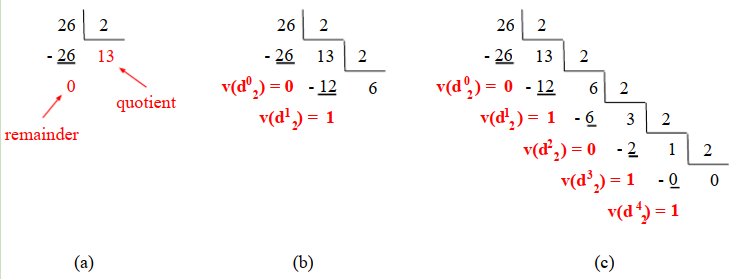


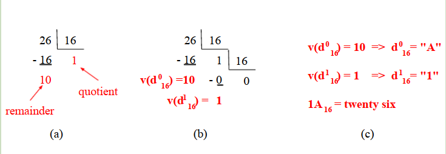

将一个数字从基A的位置数字系统转换到基B的位置数字系统，我们可以使用公式2.4计算出数字在基A上的值，然后使用算法2计算出他在基B上的表示方式，即 $d_B^{m-1}d_B^{m-2}...d_B^1d_2^0$。


在16机制中表示数字要比2进制紧凑。例如，100的十六进制表示是 $3E8_{16}$，只需要3个digit，而二进制（ $1111101000_2$）需要10个digit。因为两者的基都是2的幂，这些基之间的转换可以通过用一个十六进制数字替换连续4位的子集来完成，反之亦然。例如，公式2.8展示了如何将数字 $3E8_{16}$转换为二进制，公式2.9展示了如何将数字 $1111101000_2$转换为十六进制。


$$
{\underbrace{3}_{0011_2}\underbrace{E}_{1110_2}\underbrace{8}_{1000_2}}_{16}= 001111101000_2 = 1111101000_2 \tag{2.8}
$$


$$
{\underbrace{10}_{2_{16}}\underbrace{1101}_{D_{16}}\underbrace{0111}_{7_{16}}\underbrace{0101}_{5_{16}}}_2= 2D75_{16} \tag{2.9}
$$


# 2.2 在计算机中表示数字

一个bianry digit，或者说bit，是二进制数字系统中的一个digit，它的值是0或1。大多数现代计算机都是用数字电路制造的。这些机器通常使用映射到两种状态的电压水平（voltage levels  ）来表示信息，这两种状态可以是HIGH/LOW，或者是0/1 。因此，现代计算机的基本信息单位是bit。因此，计算机上的数字是由bianry digit（或者说bit）的序列来表示。

## 2.2.1 无符号数

在计算机上，无符号数使用m位的二进制位置数字系统表示。即由二进制的digit序列 $d_2^{m-1}d_2^{m-2}...d_2^1d_2^0$ 表示，该数字的值由公式2.5定义。

无符号整数是自然数 $(\mathbb{N})  $的子集。自然数集中的数字有无穷多个(0到无穷大)，但在计算机上能表示的无符号数的集合取决于用于表示该数字的位数。例如，如果只使用8个比特位表示数字，那么只能表示256个数字。此时最小的数是0（ $00000000_2$），最大的数是255（ $11111111_2$）。计算机上可以使用m个bit来表示 $[0 . .(2^m−1)]$范围内的自然数。

通常，编译器将编程语言的（数据）类型映射为本机（原生）类型，即计算机体系结构已知的类型。例如，在32位计算机上，C语言中的`unsigned integer`类型被编译器映射为 *32位的字*（32-bit word）。换句话说，在32位计算机上，无符号整数可以表示 $[0 . .(2^{32}−1)]$之间的数字。此时0表示为：


$$
000000000 000000000 000000000 000000000_2 \tag{2.10}
$$


而 $2^{32}−1$则表示为


$$
11111111 11111111 11111111 11111111_2 \tag{2.11}
$$


为说明这个概念，表2.3给出了可以用 *3位的字*（three-bit words）表示的无符号数的列表

| *3位的字* | 值       |
| -------------- | -------- |
| 000            | $0_{10}$ |
| 001            | $1_{10}$ |
| 010            | $2_{10}$ |
| 011            | $3_{10}$ |
| 100            | $4_{10}$ |
| 101            | $5_{10}$ |
| 110            | $6_{10}$ |
| 111            | $7_{10}$ |

> 表2.3

## 2.2.2 有符号数

在计算机中，有符号数是整数集 $(\mathbb{I})$ 的一个子集。有符号数集通常包含负数和非负数。尽管整数集是无限的，但计算机上可表示的带有符号数集取决于用于表示数字的位数以及有符号数的表示方式。最常用的有符号数表示法是“二进制补码”。接下来的几节将介绍这三种符号表示法：

* signal and magnitude （原码）
* one’s complement  （反码）
* two’s complement（二进制补码）


**Signal and magnitude（原码）**

原码是一种数字的表示方法，该方法用来在计算机上表示有符号数。在这种方法里面，有符号数用一个m位的序列来表示，其中 $d_2^{m-1}$ 表示符号，剩下的部分，即 $d_2^{m-2}$ 到 $d_2^0$ 表示大小，大小可以通过公式2.5来计算。在这种情况下，  $d_2^{m-1}$ 为1表示负数， $d_2^{m-1}$为0表示非负数。表2.4展示了 *3位的字* 分别在无符号和原码表示法下的值

| *3位的字* | 无符号下的值 | 原码下的值 |
| ------------ | ------------ | ---------- |
| 000          | $0_{10}$     | $0_{10}$   |
| 001          | $1_{10}$     | $1_{10}$   |
| 010          | $2_{10}$     | $2_{10}$   |
| 011          | $3_{10}$     | $3_{10}$   |
| 100          | $4_{10}$     | $-0_{10}$  |
| 101          | $5_{10}$     | $-1_{10}$  |
| 110          | $6_{10}$     | $-2_{10}$  |
| 111          | $7_{10}$     | $-3_{10}$  |

> 表2.4

原码表示法，能使用m位的序列表示值在 $[-(2^{m-1} - 1)..(2^{m-1} - 1)]$ 范围内数字。


**one’s complement  （反码）**

反码表示法是一种数字表示法，可以用来表示有符号数。在这种表示法中，有符号数表示为一个m位的序列，因此位 $d_2^{m−1}$表示数字的符号，如果 $d_2^{m−1}$ 为1表示负数，否则表示非负数。

用反码表示的非负数（即 $d_2^{m−1}=0$ 的数）的大小的计算方式，与计算无符号数的值的方式相同，即使用公式2.5。例如，3位bit的二进制数字010，在反码表示中是一个非负数，其大小为2，因为 $0 \times 2^2 + 1 \times 2^1 + 0 \times 2^0 = 2$。

用反码表示的负数（即 $d_2^{m−1}=1$ 的数）的大小的计算方式分为两步，首先翻转将数字的所有位都取反，然后使用公式2.5进行计算。例如，3位bit的二进制数字110在反码中是一个负数，它的大小是1（注意是大小（magnitude），不是值），因为将它取反后（001）的值是1 （ $0 \times 2^2 + 0 \times 2^1 + 1 \times 2^0 = 1$ ）。（因此这个数的值就是-1）

表2.5给出了 *3位的字* 在三种不同表示法下的值。与原码类似，在反码表示中，0有两种表示。

反码表示法，能使用m位的序列表示值在 $[-(2^{m-1} - 1)..(2^{m-1} - 1)]$ 范围内数字。

| *3位的字* | 无符号下的值 | 原码下的值 | 反码下的值 | 补码下的值 |
| ------------ | ------------ | ---------- | ---------- | ---------- |
| 000          | $0_{10}$     | $0_{10}$   | $0_{10}$   | $0_{10}$   |
| 001          | $1_{10}$     | $1_{10}$   | $1_{10}$   | $1_{10}$   |
| 010          | $2_{10}$     | $2_{10}$   | $2_{10}$   | $2_{10}$   |
| 011          | $3_{10}$     | $3_{10}$   | $3_{10}$   | $3_{10}$   |
| 100          | $4_{10}$     | $-0_{10}$  | $-3_{10}$   | $4_{10}$   |
| 101          | $5_{10}$     | $-1_{10}$  | $-2_{10}$   | $-3_{10}$   |
| 110          | $6_{10}$     | $-2_{10}$  | $-1_{10}$   | $-2_{10}$   |
| 111          | $7_{10}$     | $-3_{10}$  | $-0_{10}$   | $-1_{10}$   |

> 表2.5


**two’s complement（二进制补码）**

二进制补码表示法也是一种数字表示法，可以用来表示有符号的数。此外，在这种表示法中，有符号的数字被表示为一个m位的序列，因此digit $d_2^{m−1}$ 表示数字的正负。当 $d_2^{m−1}$ 为1时是负数，否则为非负数。

二进制补码表示的非负数的大小（即  $d_2^{m−1}=0$  的数）的计算方式与无符号数相同，即使用公式2.5。例如，在二进制补码表示中010是一个非负数，其大小为2，因为 $0 × 2^2 + 1 × 2^1 + 0 × 2^0 = 2$

二进制补码表示的负数（即   $d_2^{m−1}=1$   的数）的大小（注意是大小（magnitude），不是值）的计算，首先所有位都取反，然后加1，最后使用公式2.5。例如，在二进制补码表示中110是一个负数，它的大小是2，因为它的补码001加1的值是2（因此这个数的值就是-2）。

> 译注：这里对补码表示负数时的计算方法感觉的解释不好，这一节看CSAPP的相关章节应该更加清晰，即：
>
> 
> $$
> V= -2^{m−1} + \sum_{i=0}^{i=m-2} d_2^i \times 2^i
> $$


表2.5给出了 *3位的字* 在三种不同表示法下的值。注意在补码表示法中，0只有一种表示方式。

补码的另外一个有趣的特性是，m位的有符号数的加、减、乘法和m位的无符号数的加、减、乘法操作是相同的。因此，可以使用相同的硬件对无符号数和以“二进制补码”表示的有符号数执行这些操作。图2.3显示了一个例子，两个数相加，在两种表示法中都产生相同的结果。

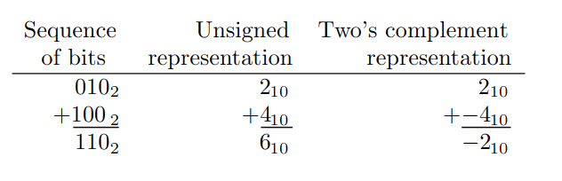

> 图2.3 

补码表示法，能使用m位的序列表示值在 $[-2^{m-1} ..(2^{m-1} - 1)]$ 范围内数字。

> 注：二进制补码是现代计算机上最常见的表示有符号数方法


## 2.2.3 二进制算术和溢出

无符号二进制数的运算类似于无符号十进制数的运算。当两个无符号二进制数相加时，从最低有效位（ $d_2^0$ ）到最高有效位（ $d_2^{m-1}$ ），即从最右边的数字到最左边的数字逐个相加。在某些情况下，两个数字相加得到的值无法用一个数字表示，此时产生一个进位，它的值必须加到下一位最高有效数字上。在二进制中，当结果大于1时就会出现这种情况。

图2.4 (a)说明了两个长度为3个bit的无符号二进制数的加法。
* 首先，两个最低有效（最右）位的数字相加。由于结果（ $2=10_2$）不能用一个二进制数表示，因此将结果的最低有效位，即0，放在当前位置，并在下一个数字的上方生成一个进位（红色箭头说明了这一过程）。
* 然后，第二个最低有效数字（1和1）必须相加。在这个例子中，因为前一位的加法有进位，所以这两位也加了进位。这个加法的结果是3( $11_2$ )，因此又产生了一个进位，并放在最高位的上面。同样，结果的最低有效数字，即1，被放置在当前位置。
* 最后，将最高有效数字和进位相加，结果为1。图2.4(b)用一个简化的（更清晰的）表示法说明了同样的加法。

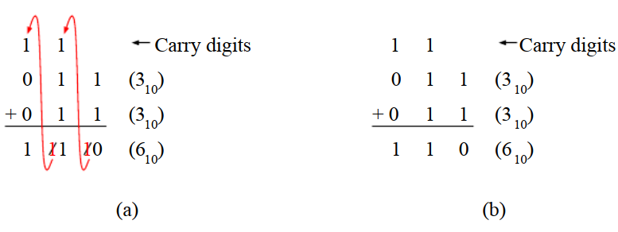
> 图2.4

无符号二进制数的减法与十进制数的减法类似。两个无符号二进制数相减时，从最低有效位（ $d_2^0$）到最高有效位（ $d_2^{m-1}$ ），即从最右到最左。有些情况下，因为第一个操作数比第二个操作数小，所以不能进行减法运算。在这种情况下，需要从左边高位借位，并且对左边高位进行计算时，这个借位必须考虑进去。

图2.5说明了两个长度为3个bit的无符号二进制数的减法。
* 图2.5 (b)展示了第一步，即减去最低有效位。由于0比1小，因此必须从左列借位。`*`号表示必须从左列借用值。这一列的结果是1，因为10（二进制）减去1等于1。
* 图2.5 (c)说明了对第二位最低有效数字执行的操作。因为右列借用了这一列，所以第一个操作数现在是0。同样，由于0比1小，因此必须从左列借位。这一列的结果是1，因为10（二进制）减去1等于1。
* 图2.5 (d)给出了最高位减法(0减去0)和最终结果。图2.5 (e)给出了减法运算的简化表示。

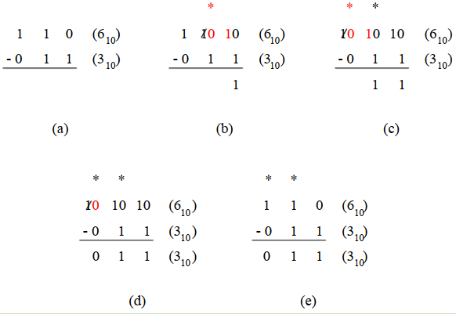
> 图2.5


## 2.2.4 整数溢出
当对两个m位二进制整数进行算术运算的结果超出了m位二进制数可以表示的范围时，就会发生整数溢出。图2.6给出了长度为3个bit的无符号数相加出现溢出的例子。在这种情况下，将1加到7应该得到8，但在无符号二进制表示中，8不能只用3个bit表示。


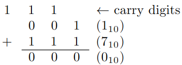
> 图2.6

虽然图2.6展示了无符号数的溢出，但它并不能展示有符号数（使用二进制补码）的溢出。在这个例子中，操作是将1（有符号数 $001$ ）减去1（有符号数 $111$），而预期的结果，即0，可以用长度为3个bit的无符号二进制数表示。

图2.7给出了一个例子，在这个例子中，两个长度为3个bit的有符号数相加会导致溢出。但在这种情况下，无符号数不会溢出。请注意，该操作的结果对于无符号数来说与预期一致，即4 (无符号数 $100$)  

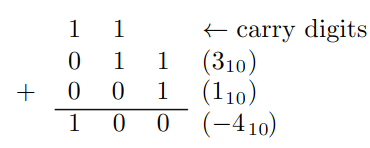

> 图2.7

> 译注：
> * 无符号和有符号进行加法时，如果进位导致结果超出该类型的最大长度，则必定会产生截取
> * 截取发生的话，对无符号数来说，结果必定是溢出
> * 对有符号数来说，溢出不一定是因为截取。截取也不一定会导致溢出
> * CSAPP中对有符号无符号数的溢出给出了非常详细的公式，可参考相关章节

# 2.3 文本的表示
在计算机上表示文本时，字符是信息的基本单位，通常对应于一个字母（例如`a`）、一个十进制数字（例如`2`）、一个标点符号（例如`.`或`?`）、空格，甚至是控制符。

字符编码标准定义了如何在计算机上表示字符。例如美国信息交换标准码（the American Standard Code for Information Interchange），即ASCII，定义了用长度为7个bit的数字来表示的字符。表2.6展示了这些字符的一部分。可见字母`a`被数字 $97_{10}(110001_2)$ 编码了，而字符`2`被数字 $50_{10}(0110010_2)$ 编码了。

|二进制|十六进制|十进制|字符|||二进制|十六进制|十进制|字符|
|---|---|---|---|---|---|---|---|---|---|
|......|......|......|......||               | $1000001_2$ | $41_{16}$ | $65_{10}$ |A|
| $0100001_2$ |$21_{16}$| $33_{10}$ |!|  |   | $1000010_2$ | $42_{16}$ | $66_{10}$ |B|
| $0100010_2$ |$22_{16}$| $34_{10}$| ”|  |   | ......      | ......    |    ...... | ...... |
|......|......|......|......||               | $1011001_2$ | $59_{16}$ | $89_{10}$ |Y|
| $0101100_2$ | $2C_{16}$ | $44_{10}$ | ,| | | $1011010_2$ | $5A_{16}$ | $90_{10}$ |Z|
| $0101101_2$ | $2D_{16}$ | $45_{10}$ | -| | | ......      | ......    |    ...... | ...... |
| $0101110_2$ | $2E_{16}$ | $46_{10}$ | .| | | $1100001_2$ | $61_{16}$ | $97_{10}$ |a|
| $0101111_2$ | $2F_{16}$ | $47_{10}$ | /| | | $1100010_2$ | $62_{16}$ | $98_{10}$ |b|
| $0110000_2$ | $30_{16}$ | $48_{10}$ | 0| | | ......      | ......    |    ...... | ...... |
| $0110001_2$ | $31_{16}$ | $49_{10}$ | 1| | | $1111001_2$ | $79_{16}$ | $121_{10}$ |y|
| $0110010_2$ | $32_{16}$ | $50_{10}$ | 2| | | $1111010_2$ | $7A_{16}$ | $122_{10}$ |z|
|......|......|......|......|||......|...... | ......      |......     |
| $0111000_2$ |$38_{16}$| $56_{10}$ |8||     | $1111100_2$ | $7C_{16}$ | $124_{10}$ |\||
| $0111001_2$ |$39_{16}$| $57_{10}$ |9||     | $1111101_2$ | $7D_{16}$ | $125_{10}$ |}|
|......|......|......|......||               | $1111110_2$ | $7E_{16}$ | $126_{10}$ |˜|

> 表2.6

ASCII字符编码标准是在20世纪60年代设计的，尽管它包含了英语语言中使用的大多数符号，但它缺少其他语言所需的几个重要符号，如带有重音的字母（例如`á`、`ç`…）。在这种情况下，其他几个字符编码标准被引进了，包括ASCII的扩展，即EASCII。根据Google在2008年的统计，UTF-8字符编码标准成为HTML文件最常用的编码。截至2020年，W3Techs网站进行的一项调查显示，超过95.5%的万维网网站使用UTF-8字符编码标准。

Unicode  Transformation Format - 8-bit ，简称为UTF-8，是一个变长的字符编码标准。在这个标准里，字符可以使用1/2/4个字节表示。公共的字符例如字母`a`，`b`和`c`使用1个字节，而更特殊的字符则使用多个字节。例如欧元符号`€`就用3个字节表示： $11100010_2, 10000010_2, 10101100_2$.   

UTF-8标准被设计为向后兼容ASCII标准。因此在UTF-8标准中，ASCII字符是用具有相同值的单个字节表示的。例如，字母`a`在两个标准中都表示为97。通过这种方式，使用UTF-8标准的软件可以自然地打开和处理ASCII编码的文件。

文本在计算机中表示为内存中的字符序列。例如，单词`Yes`由存储在连续内存位置上的三个字符序列(`Y`、`e`和`s`)表示。在使用ASCII字符编码标准的情况下，3个连续的内存位置将分别包含  $121_{10}、101_{10}、115_{10}$。图2.8说明了文本`Maçã`如何在UTF-8、ISO-LATIN-1和Mac OS Roman三种不同的字符编码标准中表示。每个方格表示一个字节，方格内的值是十六进制的。请注意，UTF-8标准需要两个字节来表示字母`ç`和`ã`。

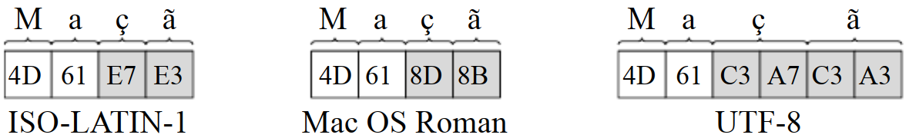


# 2.4 在内存中组织数据
本节讨论信息在计算机主存中的组织方式。讨论的重点是字节可寻址存储器（byte addressable memories），这是现代计算机上最常见的主存储器类型。


## 2.4.1 主存中的文本

如2.3节讨论，文本在计算机中表示为内存中的字符序列。序列存储在连续的*内存字*中，即具有连续地址的*内存字*。

ASCII中的字符使用7位编码，然而，当存储在字节可寻址内存中时，每个字符通常存储在一个内存字中，即它们占用8位。因此，用ASCII标准编码的5个字符的文本（例如`hello`）存储在5个连续的内存字中。

UTF-8字符使用1、2、3或4个字节编码，因此，当存储在字节可寻址内存中时，每个字符可能需要1、2、3或4个*内存字*。如图2.8所示，UTF-8需要6个字节来表示单词`Maçã`。因此，它需要6个内存字在字节可寻址内存中表示这个单词。

在编程语言中，字符串（string）这个词经常用来表示一个字符序列。以NULL结尾的字符串是一个以字符NULL结尾的字符序列，在大多数字符编码标准中，该字符由值0表示。C语言中的字符串，是以NULL结尾的字符串。因此，在C语言中，字符串`yes`需要4个内存字，3个用于存储字母`y`、`e`和`s`，另一个用于存储空字符。下面的程序展示了在C语言中声明和初始化字符串的两种不同方法。第一种方法（第2行）使用引号包裹字符序列，第二种方法（第3行）使用数组表示法，将十六进制的字符序列放在数组中。

```c
#include<stdio.h>
char name1[] = "John";
char name2[] = {0x4a, 0x6f, 0x68, 0x6e, 0x00};
int main()
{
	printf("Name 1: \"%s\"\n", name1);
	printf("Name 2: \"%s\"\n", name2);
	printf("Size of name 1 = %d\n", sizeof(name1));
	printf("Size of name 2 = %d\n", sizeof(name2));
 	return 0;
}
```

上述代码中的两个字符串（`name1`和`name2`）都需要在内存中存储5个*内存字*。事实上，由于第3行使用的十六进制值是ASCII和UTF-8编码标准中字母`J`、`o`、`h`和`n`字母的值，因此两个字符串是相同的。程序的输出如下所示：

```bash
Name 1: "John"
Name 2: "John"
Size of name 1 = 5
Size of name 2 = 5
```


## 2.4.2 主存中的数字

在2.2节讨论过，计算机上的数字由m位序列表示。如果m大于 *内存字* 大小，那么m位的序列必须拆分并存储在多个连续的 *内存字* 中。例如，一个32位的数字被分成4个8位的部分，并存储在字节可寻址存储器上的4个连续的 *内存字* 中。

*字节序* 指的是字节在计算系统内存中的存储顺序。有两种常见的格式：小端序和大端序。小端序将最低有效字节（LSB）放置在与最低地址相关的内存位置上，而大端序将最低有效字节放置在与最高地址相关的内存位置上。图2.9说明了32位数字 $00000000$ $00000000$ $00000100$ $00000001_2$ $(1025_{10})$ 如何以两种格式存储在字节可寻址内存中地址为000的地方。注意，小端序（图2.9a）的最低有效字节（ $00000001_2$ ）存储在地址000中，而大端序序 （图2.9b）的最低有效字节 （ $00000001_2 $） 存储在地址003中。


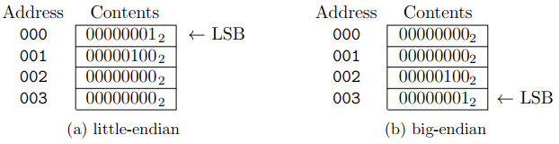

> 图2.9


## 2.4.3 主存中的数组

在编程语言中，数组是相似对象的顺序排列，其中每个对象都由索引标识。一维数组，也叫向量，是一种数组，其中的对象或数组元素由一维索引标识。下面的C语言代码显示了一个包含4个`int`类型元素的向量（`V`）和一个打印向量第一个和最后一个元素的函数。请注意，第一个元素的索引是0，而最后一个元素的索引是2。

```c
int V[] = {9, 8, 1};
void print_V()
{
	printf("First element = %d\n", V[0]);
	printf("Last element = %d\n", V[2]);
}
```

数组的元素在内存中通常以线性方式组织。因此，在将上述代码翻译为机器语言时，从`V[0]`开始，向量`V`的所有元素（`int类型`）都被放置在内存中连续的位置。**数组的基地址是用于存储该数组的第一个 *内存字* 的地址**。假设`V`的基地址是000，则第一个元素（`V[0]`）从地址000处开始存储。假设每个元素需要4个*内存字*，则第二个元素从地址004处开始存储，第三个元素地址008处开始存储。图2.10展示了`V`在内存中的布局。在这个例子中，每个元素都是32位的数字，使用小端序存储在连续的4个 *内存字* 中。


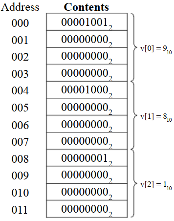

> 图2.10


前面的例子展示了一个`int`类型的数组。不过，在C语言中，程序员也可以创建其他类型的数组。例如可以创建一个`char`类型数组，其中每个元素只占一个字节，也可以创建一个`double`类型数组，其中每个元素占8个字节，甚至可以创建一个用`struct`操作符定义的新类型数组，其中每个元素可能占几个字节。

令：

* $V_{addr}$为数组 $V$ 的基地址
*  $elem_{size}$ 为 $V$ 中每个元素的大小，单位为字节
*  $V[i]$ 为 $V$ 中第 $i$ 个元素 

在C和其他几种编程语言中，数组中的每个元素 $V[i]$ 在内存中占据了 $elem_{size}$ 个*内存字*，并且在地址为 $\&V[i]$ 的地方开始存储， $\&V[i]$ 可以由公式2.12计算。


$$
\&V[i]  =  V_{addr} \times elem_{size}\tag{2.12}
$$


多维数组是一个数组，其中每个元素由多维索引标识。下面的C语言代码展示了一个包含6个`int`元素的二维数组（`M`）和一个打印数组中两个元素的函数。在这个例子中，每个元素都与一个唯一的二维索引 $[x][y]$ 相关联，因此 $x ∈ [0..1]，且 y ∈ [0..2]$ 。

```c
int M[][] = { {7, 9, 11}, {2, 8, 1} };
void print_M()
{
    printf("Element M[0][0] = %d\n", M[0][0]);
    printf("Element M[1][2] = %d\n", M[1][2]);
}
```

二维数组通常用来表示矩阵。在这种情况下，索引的第一部分（ $[x]$ ）通常用于标识行，第二部分（ $[y]$ ）用于标识列。因此，在前面的例子中，位于第一行和最后一列的元素由索引`M[0][2]`标识。

在内存中组织二维数组的方式取决于编程语言。在C语言中，元素按行分组，每一行都连续放置在内存中。因此，在前面的例子中，第一行的元素，即`M[0][0]=7、M[0][1]=9、M[0][2]=11`，首先被放在内存中。然后，将第二行的元素，即`M[1][0]=2、M[1][1]=8、M[1][2]=1`放在第一行元素之后。这种在内存中组织二维数组的方式称为 *行序* （row-major order）。

令：

*  $A$ 是C语言中 $M \times N$ 的二维数组，即 $x ∈ [0..M-1]，且 y ∈ [0..N-1]$
*  $A_{addr}$ 是 $A$ 的基地址
*   $elem_{size}$ 为 $V$ 中每个元素的大小，单位为字节
*  $A[x][y]$ 是数组中与索引`[x][y]`关联的哪个元素

在C语言中， $A[x][y]$ 在内存中占据了 $elem_{size}$ 个*内存字*，并且在地址为 $\&A[x][y]$ 的地方开始存储， $\&A[x][y]$ 可以由公式2.13计算。


$$
\&A[x][y]  =  A_{addr} + \underbrace{x \times elem_{size} \times N}_{offset1} + \underbrace{y \times elem_{size}}_{offset2} \tag{2.13}
$$


请注意，公式2.13在基址（ $A_{addr}$  ）上增加了两个偏移量， $offset1$ 和偏移量 $offset2$ 。 $offset1$ 是存储属于前一行的所有元素所需的字节数，即必须放在行 $x$ 之前的行。 $offset2$ 是存储属于同一行但必须放在元素 $A[x][y]$ 之前的所有元素所需的字节数，即列索引小于  $y$ 的元素。

> 注意：C、C++、Objective-C、PL/I、Pascal以及其它编程语言使用 *行序*  。而有些编程语言，如Fortran、MATLAB、GNU Octave、R、Julia等，在内存中使用 *列序*（column-major order）组织二维数组。在这种情况下，二维数组的元素是按列在内存中组织的，即第一列的元素放在第一位，第二列的元素放在第一列的元素之后，以此类推。


## 2.4.4 主存中的结构体（struct）

在C语言中，结构体是由用户定义的数据类型，不同类型的数据项可以被分组并组合成单一的数据类型。下面的C代码展示了一个例子，其中将一个`int`、一个包含255个`char`的一维数组和一个`short`数据项组合在一个名为`user id`的结构体中，以形成一个新的数据类型。注意，结构体中的每个数据项都由名称标识，第一个通过`id`标识，第二个通过`name`标识，第三个通过`level`标识。这些项也称为结构体的字段（fields）。

```c
struct user_id {
    int id;
    char name[256];
    short level;
};

struct user_id manager;

void print_manager()
{
    printf("Manager id = %d\n", manager.id);
    printf("Manager name = %s\n", manager.name);
    printf("Manager level = %d\n", manager.level);
}
```

假设每个`int`、`char`、`short`类型的项分别需要在内存中存储4、1、 2个字节，那么在前面的例子中定义的结构体需要在内存中存储262字节：4个字节用于存储`id`字段，256个字节用于存储`name`字段，2个字节用于存储`level`字段。

单个结构体的所有字段都按照声明时的顺序顺序存储在内存中。因此，在前面的例子中，`id`放在第一位，然后是`name`，最后是`level`。

**结构体的基址，是存储该结构体字段的第一个 *内存字* 的地址**。假设上例中变量`manager`的基址是000，那么`id`放在地址000到003上，`name`放在地址004到259上，`level`放在地址260和261上。图2-11说明了变量`manager`在内存中的内容，从地址000开始


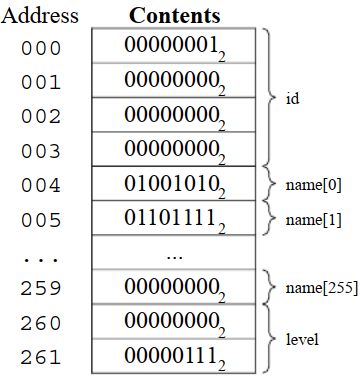

> 图2.11

# 2.5 对指令进行编码

计算机指令通常编码为一串bit。编码每条指令所需的bit数量随计算机体系结构而变化。例如，RISC-V ISA（instruction set architecture  ）定义所有RV32I指令都使用32位的bit进行编码。而x86 ISA家族的指令编码的bit数是可变的。图2-12说明了属于两种不同ISA的两条不同指令是如何编码的。

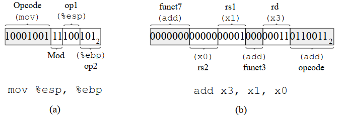

> 图2-12


图2-12a所示的16位的x86指令由4个字段组成：`opcode`、`mod`、`op1`和`op2`。操作码（opcode）字段包含一个值，计算机使用该值来识别指令。在本例中， $10001001_2$ 表示这是一条`mov`指令。其他字段`mod`、`op1`和`op2`是指令参数。在个例子中，`op1`和`op2`上的值是 $100_2$ 和 $101_2$ ，它们指定了`mov`操作必须在寄存器`%esp`和`%ebp`之间执行。

图2-12 (b)所示的32位RISC-V指令由6个字段组成：`funct7`、`rs2`、`rs1`、`funct3`、`rd`和`opcode`。`funct7`、`funct3`和`opcode`字段包含了计算机用于标识指令和必须执行的操作的值。在本例中，这些值表明这是一条`add`指令。其他字段`rs2`、`rs1`和`rd`是指令参数。`rs1`、`rs2`和`rd`上的值分别是 $0001_2$ 、  $0000_2$ 和 $0011_2$，这指明了`add`操作执行的时候，必须使用存在寄存器`x0`和`x1`的值，并且将结果写入寄存器`x3`中。

大多数现代计算机将程序的指令和数据都存储在主存中。此外，现代计算机指令使用8位的bit进行编码，以便它们和 *内存字*  的大小相适合。图2-13给出了一个x86汇编语言编写的程序如何映射到机器语言，并存储在字节可寻址内存上的例子。请注意，第一个指令`push $ebp`使用一个字节编码，而第三个指令`imul $ 113,12 (%ebp)， %eax`使用四个字节编码。另外请注意，指令在内存中是顺序放置的，与它们在原始汇编程序中出现的顺序相同。


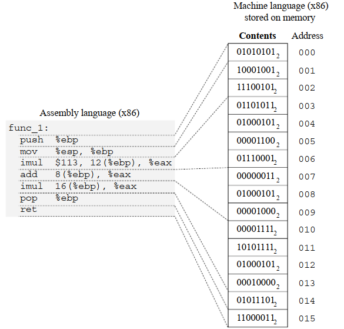
