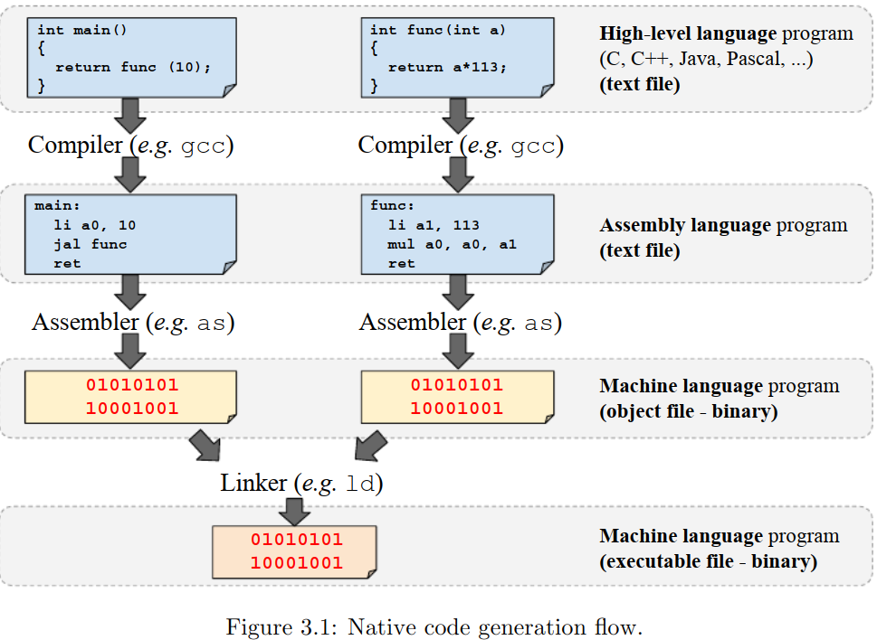

本章主要讨论汇编（assembly  ），目标文件（object ）和可执行文件（executable files）的概念

# 3.1 生成原生程序（native program）

在本节中，我们将讨论如何将用高级语言（如C）编写的程序转换为原生程序。

如第1章所述，**原生程序是一种使用指令编码的程序，这些指令可以直接由计算机硬件执行，而无需模拟器或虚拟机的帮助**。这些程序通常由编译器、汇编器和链接器等工具自动从用高级语言（如C）编写的程序转换而来。

用高级语言（如C）编写的程序被编码为纯文本文件。高级语言对ISA一无所知，它们由几个抽象元素组成，如变量、重复或循环语句、条件语句、例程（routines）等。下面的代码是一个使用C语言（一种高级语言）编写的程序示例。

> 译注：routines在计算机科学中泛指那些可重复调用、执行特定任务的代码构造，包括但不限于子程序、函数、过程、方法、宏以及特定领域的专用例程（如中断服务例程、库函数等）。它们是组织和构建复杂程序的基础构件，通过抽象、封装和复用来提升软件的开发效率和质量。

```C
int main(){
    int r = func(10);
    return r+1;
}
```

**编译器（compiler）是将程序从一种语言转换为另一种语言的工具**。通常，编程语言编译器被用来将高级语言编写的程序翻译成低级语言。例如，C编译器可以将C语言编写的程序翻译成汇编语言。GNU项目的C和C++编译器，即gcc，是一个编译器，能够将用C和C++语言编写的程序转换为汇编程序。下面的命令行说明了如何调riscv64-unknown-elf-gcc工具（一个为RISC-V的计算机生成代码的GNU C和C++编译器），从C程序生成RV32I汇编程序。在这个例子中，C程序存储在`main. c`文件中，而RV32I汇编程序存储在`main. C `文件中。

```bash
$ riscv64-unknown-elf-gcc -mabi=ilp32 -march=rv32i -S main.c -o main.s
```

汇编代码也是一个纯文本文件。下面的例子展示了一个用RV32I汇编语言编写的程序，它和上面的C语言功能相同。

```assembly
    .text
    .align 2
main:
    addi sp,sp,-16
    li a0,10
    sw ra,12(sp)
    jal func
    lw ra,12(sp)
    addi a0,a0,1
    addi sp,sp,16
    ret
```

与高级语言不同，汇编语言非常接近ISA。例如，前面的汇编程序包含了对指令（如`addi`、`li`）和属于RV32I ISA的寄存器（例如`sp`、`ra`、`a0`）的引用。上述代码中的第4行到第11行包含汇编指令，这些指令被汇编器转换为RV32I机器指令。因此，它们是ISA相关的，即为一个ISA生成的汇编程序通常与其他ISA不兼容。

**机器语言是一种可以被计算机的中央处理器（CPU）直接处理的低级语言。汇编器（assembler）是一种将汇编语言程序翻译成机器语言程序的工具**。例如，它将汇编指令（编码为ASCII字符序列）转换为机器指令（编码为ISA相关的bit序列）。每种汇编语言都与给定的ISA相关联。

GNU Assembler，即`as`，是一个汇编器，能够将用几种汇编语言编写的程序转换为对应各自ISA的机器语言。在本书中，我们将使用`as`将RV32IM汇编程序转换为机器语言程序。下面的命令行说明了如何调用`riscv64-unknown-elf-as`（一个为RISC-V ISA生成代码的GNU汇编程序）来汇编RV32I汇编程序。在这个例子中，RV32I汇编程序存储在`main.s`中，而结果（包含机器语言代码的文件）则存储在`main.o`文件中。

```bash
$ riscv64-unknown-elf-as -mabi=ilp32 -march=rv32i main.s -o main.o
```

汇编器产生的目标文件通常是用二进制编码的，包含了机器语言代码。目标文件还包含其他信息，如文件中定义的符号列表（全局变量和函数）。有几种已知的文件格式用于编码目标文件。ELF（Executable andLinking Format  ）在基于linux的系统中经常使用，而可移植可执行文件格式PE（Portable Executable  ）则在基于windows的系统中使用。在前面的例子中使用的`riscv64-unknown-elf-as`工具可以生成一个ELF格式的目标文件（object file）。

即使汇编程序生成的目标文件包含了机器语言的代码，从某种意义上说，它通常是不完整的，因为它可能仍然需要重新定位（稍后将详细介绍重定位）或与其他目标文件链接，以组成整个程序。例如，目标文件中的代码可能需要与C库链接，以便程序可以调用`printf`函数。因此，汇编程序生成的目标文件不是可执行文件。

**链接器（Linker）是一种将一个或多个目标文件“链接”在一起生成可执行文件的工具**。可执行文件是用二进制编码的，包含了机器语言的代码，在这个角度看它和目标文件类似，但它包含了执行时所需的所有元素（例如库）。

> 译注：事实上可执行文件和目标文件都是ELF格式，因此上面这段话感觉有点多余且绕了。

下面的命令行说明了如何调用`riscv64-unknown-elf-ld`工具（GNU Linker的一个分支，专门用来链接RISC-V ISA平台的目标文件）来链接两个目标文件`main.o`和`mylib.o`。在这个例子中，链接器将生成一个名为`main.x`的可执行文件。

```bash
$ riscv64-unknown-elf-ld -m elf32lriscv main.o mylib.o -o main.x
```

图3-1说明了从两个C语言源文件中，生成原生的可执行文件的过程。

* 首先，编译器将两个C源文件转换为汇编程序
* 然后，汇编器对汇编程序进行汇编，生成目标文件
* 最后，链接器将目标文件链接在一起，生成可执行文件

假设高级语言写的程序源文件是`main.c`和`func.c`，下列命令生成了一个可执行文件`main.x`，它是基于RV32I指令集的。

```bash
$ riscv64-unknown-elf-gcc -mabi=ilp32 -march=rv32i -S main.c -o main.s
$ riscv64-unknown-elf-as  -mabi=ilp32 -march=rv32i main.s -o main.o

$ riscv64-unknown-elf-gcc -mabi=ilp32 -march=rv32i -S func.c -o func.s
$ riscv64-unknown-elf-as  -mabi=ilp32 -march=rv32i func.s -o func.o

$ riscv64-unknown-elf-ld -m elf32lriscv main.o func.o -o main.x
```





> 图3.2


## 3.1.1 查看目标文件和可执行文件中的内容

目标文件和可执行文件编码为二进制文件，因此不容易直接查看其内容。为了检查它们的内容，开发人员通常依赖一些工具将它们的信息解码并转换为人类可读的表示形式（通常是文本格式）。有几个工具可以用来检查目标和可执行文件的内容。`objdump`、`nm`和`readelf`可以用于检查基于linux系统的目标和可执行文件的内容。以下几节将展示如何使用这些工具。


# 3.2 标签（Labels ）、符号、引用和重定位

## 3.2.1 标签和符号

**标签是表示程序位置的“标记”**。它们通常由以冒号（`:`）结尾的英文单词定义，可以插入到汇编程序中，以标记程序位置，以便汇编代码或其他汇编命令（例如directive）引用。

下面的代码展示了一个汇编程序，它包含两个标签，分别是定义在第1行的`sum10:`和定义在第4行的`x:`。`x:`标记了变量的位置，该变量由第2行的`.word 10`指令分配和初始化。`sum10:`标记标识了包含`sum10`例程第一个指令的程序位置，换句话说，它定义了例程入口。同样，在这个例子中，标签`x:`被第5行的`lw`指令用来引用变量`x`。

```assembly
x:
	.word 10

sum10:
	lw a0, x
	addi a0, a0, 10
	ret
```

全局变量和例程是存储在计算机主存中的程序元素。每个变量和每个例程占用一段 *内存字* ，并由它们占用的第一个 *内存字* 的地址标识。要读取全局变量的内容，或执行一个例程，知道它们的地址就足够了，即它们占据的第一个 *内存字* 的地址。另一方面，在链接器将多个目标文件链接为一个文件之后，分配给变量和例程的地址在可执行文件上是固定的。因此，汇编程序需要一种机制来引用全局变量和例程。这可以通过使用标签来实现，如前面的例子所示。在这种情况下，在为每个全局变量分配空间或为每个例程生成代码之前，程序员（或编译器）定义一个标签，用于标识变量或例程。

**程序中的符号（symbol）是一个与数值相关联的名称（name），而符号表（symbol table）是将每个程序符号映射到其值的数据结构**。标记由汇编程序自动转换为程序符号，并与一个表示其在程序中的位置的数值相关联，该数值是一个内存地址。汇编程序将所有符号添加到程序的符号表中，该符号表也存储在目标文件中。

我们可以通过使用工具来检查目标文件的内容，这些工具解码目标文件上的信息，并以人类可读的格式（即文本格式）显示它们。例如，GNU的`nm`可用于检查目标文件的符号表（symbol table）。假设前面的代码被编码到一个名为`sum10.o`的目标文件中。我们可以通过执行`riscv64-unknown-elf-nm`工具来检查其符号表，如下所示。

```bash
$ riscv64-unknown-elf-nm sum10.o
00000004 t .L0
00000004 t sum10
00000000 t x
```

在这个例子中，符号表包含了3个符号：`.L0`、`sum10`和`x`，它们的值分别是00000004、00000004和00000000。

程序员也可以使用`.set`指令显式地定义符号。下列代码展示了一个汇编代码片段，它使用`.set`指令定义了一个名为`answer`的符号，并为其赋值42。

```assembly
	.set answer, 42
get_answer:
	li a0, answer
	ret
```

假设前面的代码存储在名为`get answer.s`的文件中，我们可以使用下面的命令对它进行汇编并检查目标文件中的符号表：

```bash
$ riscv64-unknown-elf-as -march=rv32im get_answer.s -o get_answer.o
$ riscv64-unknown-elf-nm get_answer.o
0000002a a answer
00000000 t get_answer
```

注意，符号表包含`answer`和`get answer`两个符号。`answer`是一个绝对符号（由输出的字母a表示），也就是说它的值在链接过程中不会改变。`get answer`则表示`.text`节（section）中的一个位置，在重定位过程中其值（即地址的值）可能会改变。下一节将讨论重定位过程和程序节（program section）的概念

## 3.2.2 标签的引用和程序的重定位

在汇编（assembling）和链接过程中，对标签的每个引用都必须被一个地址替换。例如，在前面的代码中，在汇编程序时，`lw`指令中对标签`x:`的引用被替换为地址0，即`x`所表示的变量的地址。

为了说明这个概念，让我们考虑下面的RV32I汇编程序，其中包含4条指令和两个标签。第一个标签`trunk42`（第1行）标识了一个函数的入口点，第二个标签`done` （第5行）标识了一个程序位置，是分支指令（第3行）的目标。

```assembly
trunk42:
    li t1, 42
    bge t1, a0, done
    mv a0, t1
done:
    ret
```

在汇编（assembling）该程序时，汇编器将每条汇编指令（例如，`li`，`bge`，…）翻译成一条32位的机器指令。因此，该程序总共占用16个 *内存字* ，每个指令占4个。同样，汇编程序将第一条指令映射到地址0，第二条指令映射到地址4，以此类推。在这种情况下，标记程序开始的`trunk42`标签与地址0相关联，标记指令`ret`所在位置的`done`标签与地址c（这是一个16进制的地址值）相关联。由于`bge`指令对`done`标签有一个引用，汇编程序把，与`done`标签（地址c）相关联的地址编码到该指令中。

GNU objdump可以用来检查目标文件的一些内容。下面的例子展示了如何使用`riscv64-unknown-elf-objdump`对`trunk.o`文件中的数据和指令进行解码，以便我们检查其内容。

> 译注：这里需要先使用命令`riscv64-unknown-elf-as -march=rv32im trunk.s -o trunk.o`先生成目标文件

```bash
$ riscv64-unknown-elf-objdump -D trunk.o

trunk.o:     file format elf32-littleriscv

Disassembly of section .text:

00000000 <trunk42>:
   0:   02a00313                li      t1,42
   4:   00a35463                bge     t1,a0,c <done>
   8:   00030513                mv      a0,t1

0000000c <done>:
   c:   00008067                ret
...
```

请注意，上面的结果显示了每条指令的地址、编码后的十六进制的值，和类似于汇编代码的文本。例如，`bge t1, a0, done`指令被编码为32位的值00a35463，地址是4。`objdump`引用了`done`，并将它映射到地址c （`bge t1,a0,c <done>`）。另外，请注意标签（及其地址）出现在程序中各自的位置上。

在前面的例子中，`trunk4`函数的地址是0，但在将目标文件`trunk.o`链接到其他文件时，链接器可能需要移动代码（分配新地址），使它们不占用相同的地址（译注：因为其它的目标文件中的函数可能也使用了0这个地址）。在这个过程中，与标签相关联的地址可能会改变，对标签的每个引用也必须修正以反映新的地址。

**重定位（Relocation  ）是为代码和数据分配新的内存地址的过程**。如前所述，在重定位过程中，链接器需要调整代码和数据，以反映新的地址。**更具体地说，必须调整符号表中与标签相关联的地址和对标签的引用**。

**重定位表是一个数据结构，包含了一些信息，这些信息描述指令和数据需要如何修改以反映地址重分配**。每个目标文件都包含一个重定位表，在执行重定位过程时，链接器使用它们的信息来调整代码。

下面的例子展示了如何使用`riscv64-unknown-elf-objdump`检查`trunk.o`文件中的重定位表的内容。。请注意，在这个例子中，目标文件包含一个重定位记录，它表明地址4上的指令（一个RISC-V分支指令）包含了对标签`done`的引用。当`done`分配新地址时，链接器使用该信息来调整`branch`指令的内容。

```bash
$ riscv64-unknown-elf-objdump -r trunk.o
# 译注：-r表示查看文件中的重定位项（entry）
trunk.o:     file format elf32-littleriscv

RELOCATION RECORDS FOR [.text]:
OFFSET   TYPE              VALUE
00000004 R_RISCV_BRANCH    done
```

下面这个例子展示了对之前那个程序进行链接的话会发生的事情。首先，通过调用链接器生成文件`trunk.x`。然后使用`riscv64-unknown-elf-objdump  `检查`trunk.x`中的内容：

```bash
$ riscv64-unknown-elf-ld -m elf32lriscv trunk.o -o trunk.x
# -m表示设置模拟的平台
# 译注：执行上面这条命令会报一个警告："warning: cannot find entry symbol _start; defaulting to 0000000000010074"
$ riscv64-unknown-elf-objdump -D trunk.x

trunk.x: file format elf32-littleriscv

Disassembly of section .text:

00010054 <trunk42>:
   10054: 02a00313 li t1,42
   10058: 00a35463 bge t1,a0,10060 <done>
   1005c: 00030513 mv a0,t1

00010060 <done>:
   10060: 00008067 ret
...
```

可见`trunk.x`中的代码被重定位了，一些变量被分配了新的地址。例如例程`trunk42`的地址是10054，`bge`指令跳转到地址10060（当寄存器`t1`的值大于等于`t0`的值时）

> 译注：地址重定位后的值似乎跟工具的版本有关系，本人用riscv64-unknown-elf.gcc-12.1.0工具链上执行上述命令，`trunk42`和`done`的重定位值如下所示
>
> ```bash
> 00010074 <trunk42>:
>    10074:       02a00313                li      t1,42
>    10078:       00a35463                bge     t1,a0,10080 <done>
>    1007c:       00030513                mv      a0,t1
> 
> 00010080 <done>:
>    10080:       00008067                ret
> ```

## 3.2.3 未定义（Undefined）的引用

## 3.2.4 全局符号与局部符号

## 3.2.5 程序的入口


# 3.3 程序节（Program sections）

# 3.4 可执行文件 vs 目标文件

