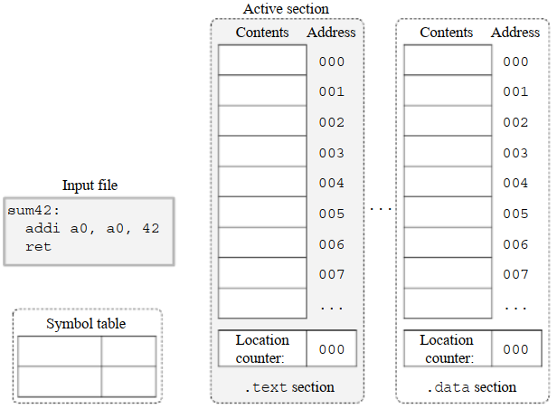
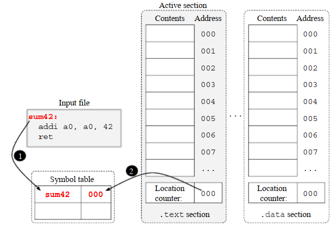
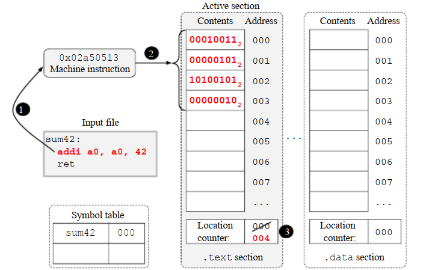
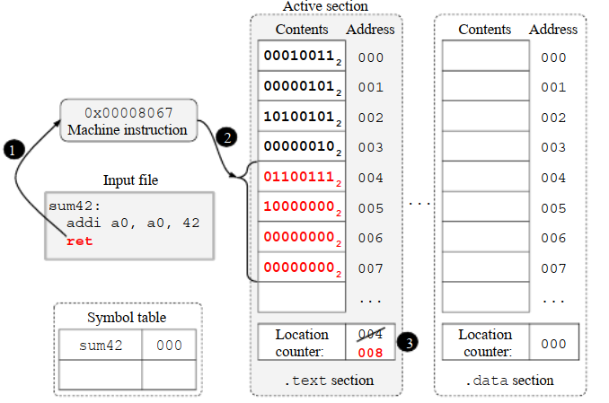
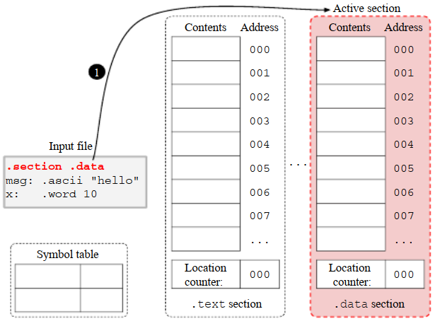
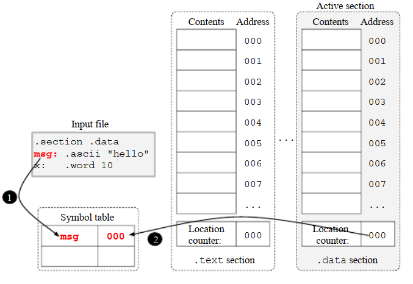
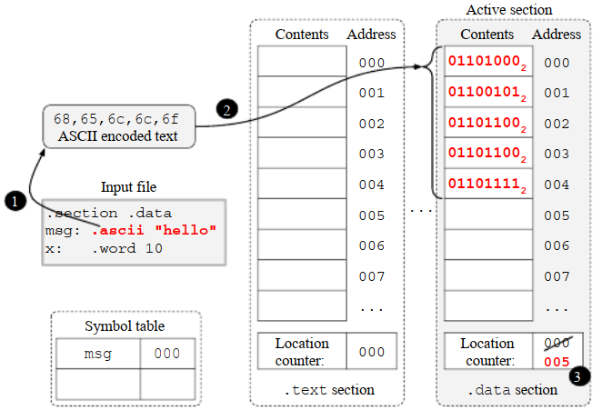
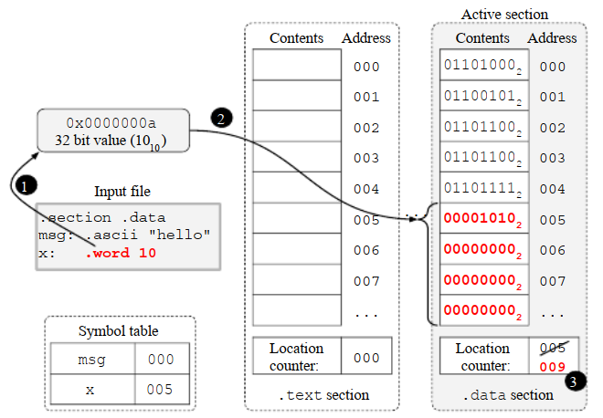

汇编程序被编码为纯文本文件，包含以下4项主要元素：

* 注释（comments）：注释是文本格式的补充记录，通常用于记录代码信息，但是它们对代码生成没有影响，汇编器会丢弃它们
* 标签（Labels）：如第3.2.1节所讨论的，标签是表示程序位置的“标记”。它们通常由以冒号 + 标签名称组成，并且可以插入到汇编程序中以标记程序位置，以便它可以被汇编指令或其他汇编命令（如汇编命令）引用
* 汇编指令（instructions）：汇编指令被汇编器用来转换为机器指令。它们通常被编码为字符串，包含助记符和参数序列（称为操作数）。例如，`addi a0, a1, 1`字符串包含助记符`addi`和三个操作数：`a0`, `a1`和`1`
* 汇编命令（directives）：汇编命令是用于协调汇编过程的命令。它们由汇编器解释。例如，汇编命令`.word 10`指示汇编器将32位的值（10）添加到程序中。汇编命令通常被编码为以下格式的字符串：点（.）+ 汇编命令名称 + 参数字

如前所述，注释对汇编过程没有影响，汇编器会将其丢弃。这通常由预处理器执行，它会删除所有注释和额外的空格。一旦去掉注释和额外的空格，汇编程序就只包含三种元素：标签、汇编指令和汇编命令。假设`<label>`、`<instruction>`和`<directive>`分别表示有效的标签、汇编指令和汇编指令，则在删除汇编语言的注释和额外的空格后，可以使用以下正则表达式来总结汇编语言的语法。

```assembly
PROGRAM    -> LINES
LINES      -> LINE ['\n' LINES]
LINE       -> [<label>] [<instruction>] |
              [<label>] [<directive>]
```

上述规则的前两行表明汇编代码由一行或者多行组成，每行之间用换行符`\n`分割。而最后一条规则表明：

* 行的内容可以为空，因为`<label>`、`<instruction>`和`<directive>`都是可选的
* 行能只包含：单个标签、单个汇编指令、单个汇编命令
* 行能只包含：标签 + 汇编指令
* 行能只包含：标签 + 汇编命令

下面的RV32I汇编代码包含了合法的行：

```assembly
x:
sum: addi a0, a1, 1
     ret
.section .data
y:   .word 10
```

下面的RV32I汇编代码包含了非法的行：

```assembly
x: z:
addi a0, a1, 1 sum:
	li a0, 2 li a1, 1
.word 10 .word 20
	.word 10 y:
addi a0, a1, 1 .word 12
.sdfoiywer 1    
```

* 第一行包含两个标签
* 第二行的指令在标签后（注意，当两者位于同一行时，标签必须位于指令之前)
* 第三行包含两个指令
* 第四行包含两个汇编命令，但是每行只允许一个指令或汇编命令。
* 第五行的汇编命令在标签后，但是，当两者位于同一行时，标签必须位于汇编命令之前。
* 第六行包含一个指令和一个汇编命令
* 七行包含一个无效汇编命令


下面的RV32I汇编代码也是非法的，因为单个指令的所有元素（助记符、操作数）必须位于同一行。汇编命令也同样有这个要求。

```assembly
addi
a0, a1, 1
```

GNU汇编器实际上是一系列汇编器的集合。它支持几种ISA，包括RV32I。虽然每种GNU汇编器处理的汇编语言是不同的（这是因为每种汇编语言的指令都和各自的机器指令相似且相互之间不同），但它们中的大多数使用相同的语法表示注释、标签和汇编命令。在这个场景下，一旦你学习了一种汇编语言，则容易学会另外一种新的汇编语言。

本书专门讨论能被GNU汇编器支持的RV32I汇编语言。接下来的章节会讨论RV32I中的注释、标签、汇编指令、汇编命令。

 

# 4.1 注释

RV32I汇编程序可能包含单行或多行注释。在GNU汇编器上，单行注释由一个行注释符分隔，该字符与目标平台相关，即它依赖于某个ISA。RV32I GNU汇编器使用`#`作为行注释符。在同一行中，`#`之后的所有字符都被认为是注释的一部分，下面的汇编代码展示了行注释的示例。

```assembly
x: .word 10 # This is a comment
foo: # My special function
    addi a0, a1, 1 # Adds one to a1 and store on a0 #
# This is # another # comment ## #
```

因为汇编预处理器会抛弃注释，它相当于以下代码：

```assembly
x: .word 10
foo:
    addi a0, a1, 1
```

多行注释是内容占用多行的注释，在GNU 汇编器中用配对的`/* */`符来分割它们

```assembly
sum1:
/* This
is
a
multi-line
comment.
*/
	addi a0, a1, 1
	ret
```

它相当于以下代码

```assembly
sum1:
	addi a0, a1, 1
	ret
```


# 4.2 汇编指令（Assembly instructions）

汇编器将汇编指令转换成机器指令，它们通常编码为一个字符串，其中包含一个助记符和一系列参数，这些参数称为操作数。例如，汇编指令`add x10, x11, x12`以17字节（每个字符一个字节）编码为纯文本，被汇编器转换为相应的机器指令，这个机器指令用4字节编码后的值为0x00c58533。

伪指令是这样一种汇编指令：它在ISA上没有对应的机器指令，但可以由汇编器自动翻译成一个或多个替代的机器指令，以达到相同的效果。例如， *no操作指令*（no operation instruction）  或 `nop`是一个RV32I伪指令，它被汇编器转换为指令`addi x0, x0, 0`。另一个例子是`mv`指令，它将一个寄存器的内容复制到另一个寄存器中。这种情况将由伪指令`mv a5, a7`模拟，该伪指令将`a7`的内容复制到`a5`中。而这个伪指令将被转换为指令`addi a5, a7, 0`，它将`a7`中的值加0，并将结果存储在寄存器`a5`中。

附录A列出了大部分RV32I汇编指令，第二部分的各章讨论了如何使用这些指令实现程序结构，包括条件语句、循环和例程。

汇编指令的操作数可以是以下几种之一：

* 寄存器名：一个寄存器名标识ISA中的一个寄存器。RV32I ISA寄存器编号从0到31，命名为`x0`, `x1`，…, `x31`。RV32I寄存器也可以通过别名识别，例如`a0`、`t1`、`ra`等。附录A给出了RV32I寄存器及其别名的列表。
* 立即数（immediate value）：立即数是一个常量，直接编码到机器指令中。
* 符号名：符号名标识符号表中的符号，并在汇编和链接过程中由它们各自的值替换。例如，它们可以标识由用户显式定义的符号或由汇编器自动创建的符号（例如标签）。它们的值也直接编码到机器指令中。


# 4.3 立即数（immediate value）

在汇编语言中，立即数由 *字母数字字符（alphanumeric characters）* 序列表示。

* 以`0x`开头的序列：被解释为十六进制
* 以`0b`开头的序列：被解释为二进制
* 以`0`开头的序列：被解释为八进制
* 以`0~9`开头的序列：被解释为十进制

用单引号包住的字符会根据ASCII规范转换为数字，例如操作数`'a'`被转换为值97。下列代码展示了使用立即数作为操作数的指令:

```assembly
li a0, 10 # 将10这个值加载到寄存器a0
li a1, 0xa # 将10这个值加载到寄存器a1
li a2, 0b1010 # 将10这个值加载到寄存器a2
li a3, 012 # 将10这个值加载到寄存器a3
li a4, '0' # 将48这个值加载到寄存器a4
li a5, 'a' # 将95这个值加载到寄存器a5
```

要表示负整数，只需要加上负号` - `前缀即可。例如：

```assembly
li a0, -12 # 将-12这个值加载到寄存器a0
li a1, -0xc # 将-12这个值加载到寄存器a1
li a2, -0b1100 # 将-12这个值加载到寄存器a2
li a3, -014 # 将-12这个值加载到寄存器a3
li a4, -'0' # 将-48这个值加载到寄存器a4
li a5, -'a' # 将-97这个值加载到寄存器a5
```


# 4.4 符号名

程序符号是与数字相关联的“名称”，而符号表则是将每个程序符号映射到其值的数据结构。**标签由汇编器自动转换为符号**。此外，程序员或编译器也可以使用汇编命令`.set`显式地创建符号。

> 译注：注意符号（symbol）是ELF中的概念，而标签（label）则是汇编语言中的概念，因此汇编过程中会将标签转换为符号

符号的名称由一系列*字母数字字符*和下划线（`_`）组成。但第一个字符不能是数字字符。以下是有效的符号名称示例：

* `x`
* `var1`
* `z12345`
* `_x`
* `_`
* `_1`
* `_123`
* `_a12b`

以下是无效字符的名称示例：

* `1`
* `1var`
* `z@12345`
* `x-y`
* `-var`
* `a+b` 

下列代码展示了使用符号名称作为操作数的指令示例（第4行和第5行）。汇编命令`.set`（第1行）创建了符号`max_temp`并赋值100。`li`（load immediate）指令（第4行）将符号`max_temp`的值加载到寄存器`t1`中。如果寄存器`a0`中的值小于或等于寄存器`t1`中的值，则`ble`（branch less equal  ）指令跳转到符号`temp_ok`表示的代码位置（由标签`temp_ok`自动定义）

```assembly
.set max_temp, 100 # 设max_temp的最大限制

check_temp: # check_temp例程
	li t1, max_temp # 将max_temp加载到t1
	ble a0, t1, temp_ok # 如果a0 <= max_temp, 则跳转到temp_ok例程
	jal alarm # 否则调用alarm例程
temp_ok:
ret # 返回
```


# 4.5 标签

如3.2.1节所述，标签是表示程序位置的“标记”。它们可以被指令和汇编命令引用，并在汇编和链接过程中被转换为地址。

GNU汇编器通常接受两种标签：符号标签和数字标签。符号标签作为符号存储在符号表中，通常用于标识全局变量和例程。它们标签名称 + 冒号（:）组成。标签名称的命名规则与前一节的符号名称相同。下面的代码包含两个符号标签：`age:`和`get_age:`。

```assembly
age: .word 42

get_age:
	la t1, age
	lw a0, (t1)
	ret
```

数字标签由一个十进制数字后跟一个冒号（:）定义。它们用于本地引用，不会包含在可执行文件的符号表中。此外，它们可以在同一个汇编器中被重复定义。

引用数字标签时需要一个后缀，表示该引用是位于引用之前（用b作为后缀）还是之后（用f作为后缀）的数字标签。下面的代码包含了数字标签及其引用的示例。这段代码有一个符号标签`pow`和两个数字标签（都命名为`1:`）。第一个数字标签位于第7行，表示属于循环的指令序列的开始。位于第11行的跳转指令跳回到这个标签。注意`1b`这个引用，它指向的是位于当前位置之前的数字标签`:1`。第二个数字标签（位于第12行）标记了位于循环之后的指令的位置，即执行流离开循环时必须执行的指令。当寄存器`a1`的值等于0时，第8行的指令跳转到这个数字标签。注意`1f`这个引用，它指向位于当前位置之后的数字标签`1:`。

```assembly
# Pow 函数 -- 计算 a^b
# 输入: a0=a, a1=b
# 输出: a0=a^b
pow:
	mv a2, a0 # 将a0保存到a2
	li a0, 1 # 将a0设为1
1:
	beqz a1, 1f # 如果a1 = 0则退出
	mul a0, a0, a2 # 否则相乘
	addi a1, a1, -1 # 计数器减一
	j 1b # 重复（跳转到前面的数字标签）
1:
	ret
```


# 4.6 位置计数器（location counter）和汇编的过程

位置计数器是一个内部的汇编计数器，用于在程序组装时跟踪地址。更确切地说，它保存了下一个可用内存位置的地址。每个节都有自己的位置计数器，而 *活跃位置计数器*（active location counter） 就是 *活跃节*（active section）的位置计数器。
为了讨论位置计数器在整个汇编过程中是如何使用和更新的，我们将逐步汇编以下程序：

```assembly
sum42:
	addi a0, a0, 42
    ret
```

在开始时，GNU汇编器清空节和符号表的内容，将所有位置计数器初始化为0，并选择`.text`节作为 *active section* 。图4.1说明了内部汇编器数据结构在启动时的状态。



> 图4.1

一旦内部的数据结构初始化了，汇编器就按顺序逐行读入程序中的代码，根据标签、指令、汇编命令在程序中出现的顺序逐个去处理它们。

我们的汇编程序中的第一个元素是一个名为`sum42:`的标签。在处理标签时，汇编器在符号表中将其注册为符号，并将其与表示程序当前位置的地址关联起来。当前位置由 *active location counter* 表示。图4.2说明了在汇编器处理`sum42:`标签时符号表是如何更新的。请注意，汇编器将名称`sum42`注册到符号表（❶），并将其关联到地址0（❷），即 *active location counter* 的地址。




我们汇编器中的下一个元素是汇编指令`addi a0, a0, 42`。在这种情况下，汇编器将其转换为一条机器指令（❶），将其添加到 *active section* 的某个位置（❷），这个位置的地址存于 *active location counter* 中，最后更新 *active location counter* 使其指向下一个可用地址（➌）。在这种情况下，*active location counter* 的值增加4，因为添加到 *active section* 的RV32I指令需要4个内存字。图4.3说明了这个过程




> 图4.3


汇编程序中的最后一个元素也是汇编指令。同样，汇编器将其转换为一条机器指令（❶），将其添加到 *active section* 的某个位置（❷），这个位置的地址存于 *active location counter* 中，最后更新 *active location counter* 使其指向下一个可用地址（➌）。这个过程如图4 - 4所示。




> 图4.4


在处理完输入文件的所有元素之后，汇编器将节的内容、符号表和其他相关信息（如重定位记录）写到目标文件上。

# 4.7 汇编命令（Assembly directives  ）

汇编命令是用来控制汇编器的。例如，`.section` `.data`命令指示汇编程序将`.data`节转换为 *active section* ，而`.word 10`命令指示汇编器汇编一个32位的值（10）并将其添加到 *active section* 中 。
汇编命令通常编码为字符串，包含命令名称及其参数的。在GNU汇编器中，指令名以点（`.`）开头。下面几节将讨论一些用于实现汇编程序的最常见指令。

## 4.7.1 向程序添加值

表4.1包含了能向汇编程序中添加值的汇编命令

| 汇编命令名称 | 参数                       | 描述                                              |
| ------------ | -------------------------- | ------------------------------------------------- |
| `.byte`      | expression [, expression]* | 生成1个或多个8 bit的、用逗号隔开的的*字*（word）  |
| `.half`      | expression [, expression]* | 生成1个或多个16 bit的、用逗号隔开的的*字*（word） |
| `.word`      | expression [, expression]* | 生成1个或多个32 bit的、用逗号隔开的的*字*（word） |
| `.dword`     | expression [, expression]* | 生成1个或多个64 bit的、用逗号隔开的的*字*（word） |
| `.string`    | 字符串                     | 生成用`NULL`结尾的字符串                          |
| `.asciz`     | 字符串                     | 作用同`.string`命令，是它的别名                   |
| `.ascii`     | 字符串                     | 生成字符串，但末尾不包含`NULL`                    |

> 表4.1

表4.1中的所有命令都将值添加到 *active section* 。`.byte`、`.half`、`.word`和`.dword`命令向 *active section*  添加一个或多个值。它们的参数可以表示为立即数（4.3中讨论过立即数），符号（在汇编和链接过程中会被替换为它们的值），或由将两者结合起来的算术表达式。下面的代码展示了这些命令的有效参数示例。

* 第一行中的`.byte`向 *active section* 添加了4个8 bit的值（10、12、97和10）
* 第二行中的`.word`命令将与符号`x`相关联的32 bit值添加到.string、。ascii和。ascii指令将字符串添加到活动部分。该字符串编码为一个字节序列，将在2.3节讨论。.string和。asciz指令还在字符串后面添加了一个值为0的额外字节。在向程序添加以空字符结尾的字符串时，它们很有用。
  为了说明前面指令的用法，我们组装如下程序，它将值添加到。data部分:
* 。请注意，与符号`x`关联的值是分配给标签`x:`的地址
* 第三行中的`word`命令也向 *active section* 添加了一个32 bit的值，但在这里，这个值是在符号`y`的值（即分配给标签`y:`的地址）再加4

```assembly
x: .byte 10, 12, 'A', 5+5
y: .word x
z: .word y+4
i: .word 0
j: .word 1
```

`.string`、`.asciz`和`.ascii`指令将字符串添加到 *active section* 。该字符串编码为一个字节序列（如2.3讨论的那样）。`.string`和`.asciz`命令还在字符串后面添加了一个值为0的额外字节。如果需要生成以NULL结尾的字符串时，这两个命令很有用。
为了说明前面命令的用法，我们汇编如下程序，将值添加到`.data`节:

```assembly
.section .data
msg: .ascii "hello"
x: .word 10
```

在4.6节讨论过，GNU汇编器首先清除节和符号表的内容，将所有位置计数器初始化为0，并选择`.text`节作为*active section*。然后，它开始处理输入文件。输入文件中的第一个程序集元素是`.section .data`命令，它指示汇编程序将`.data`作为活动节。图4.5说明了这个过程。



> 图4.5


汇编程序中的下一个元素是`msg: `标签。在这种情况下，汇编器在符号表中注册名为`msg`的符号（❶），将其与表示程序当前位置的一个地址关联起来（❷），该地址由 *active location counter* 表示，即`.data`节的位置计数器。图4.6说明了这个过程。



> 图4.6

汇编器中的下一个元素是`.ascii "hello"`命令，它指示汇编程序向  *active section* 添加一个字符串。假设我们的输入文件是使用ASCII标准编码的，那么汇编器将字符串编码为基于ASCII标准的字节序列（❶），将这些字节添加到 *active section* 的下一个可用地址（❷），更新位置计数器（➌）。图4.7说明了这个过程



> 图4.7


程序中下一个元素是`x:`标签。在这种情况下，汇编器在符号表中注册名为`x`的符号，并将其与表示程序当前位置的地址关联起来，即关联到*active location counter*中的地址。

最后，程序中的最后一个元素是`.word 10`命令，它指示汇编器向*active section*添加一个32位值。在这种情况下，汇编器将32位值编码为一个4字节的序列（❶），使用小端法将这些字节存储在*active section*上（❷），然后更新位置计数器（➌）。图4.8说明了这个过程。



> 图4.8

## 4.7.2

## 4.7.3

## 4.7.4

## 4.7.5

## 4.7.6