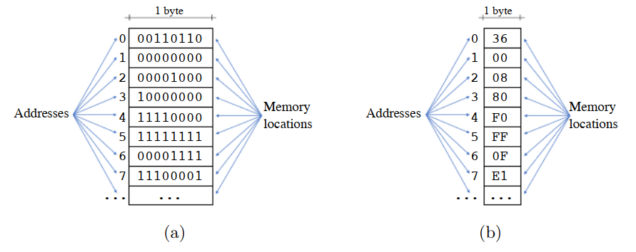
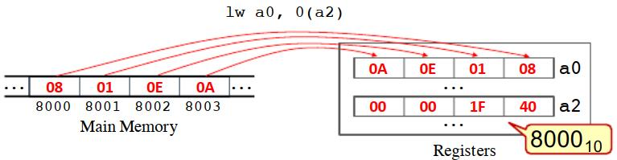
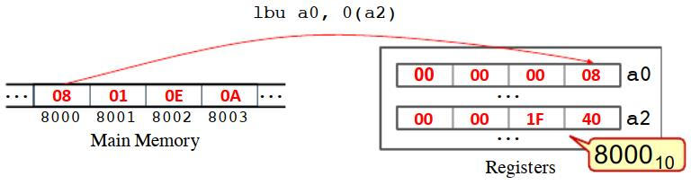
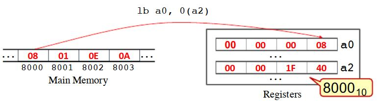
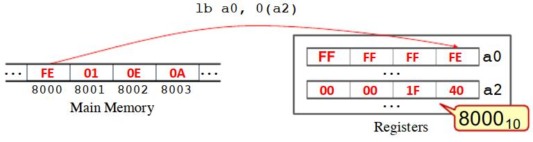

RISC-V是一种模块化的指令集体系结构，允许设计各种微处理器。这种灵活性允许行业参与者为具有不同需求的应用程序设计微处理器，包括用于嵌入式设备的超低功耗和紧凑的微处理器，以及用于运行在数据中心上的强大服务器的高性能微处理器。

为了实现这种灵活性，RISC-V的ISA依赖于4种基本ISA和几种扩展，以实现ISA的专用版本。表6.1给出了基本的ISA及其一些扩展。

**基本指令集**

| 名称   | 描述                             |
| ------ | -------------------------------- |
| RV32I  | 32位整数指令集                   |
| RV32E  | 32位整数指令集（嵌入式微处理器） |
| RV64I  | 64位整数指令集                   |
| RV128I | 128位整数指令集                  |


**扩展指令集**

| 名称 | 描述                                                     |
| ---- | -------------------------------------------------------- |
| M    | 乘法标准扩展                                             |
| A    | 原子指令标准扩展                                         |
| F    | 单精度浮点数标准扩展                                     |
| D    | 双精度浮点数标准扩展                                     |
| G    | 基本指令集 + 以上扩展，即基本指令集 + MAFD               |
| Q    | 四精度（quad-precision）浮点数标准扩展                   |
| L    | 十进制浮点数标准扩展                                     |
| C    | 压缩的指令（compressed instructions）标准扩展            |
| B    | 位操作标准扩展                                           |
| J    | 动态转换语言（dynamically translated languages）标准扩展 |
| T    | 事务性内存标准扩展                                       |
| P    | 单指令多数据流标准扩展                                   |
| V    | 向量操作标准扩展                                         |
| N    | 用户级中断标准扩展                                       |
| H    | hypervisor标准扩展                                       |

> 表6.1

在本书中，我们将专注于RV32IM，它包括RV32I基本指令以及支持乘除法的M扩展指令。RV32IM具有以下属性:

* 支持32位地址空间
* 包含33个32位寄存器
* 使用二进制补码表示有符号整数
* 含有基本指令，包括整数计算指令，整数加载/存储指令，流程控制指令
* 包含对寄存器中的值进行乘法、除法指令


# 6.1 数据类型和内存组织

ISA原生数据类型是ISA可以天生就能自然处理的数据类型，表6.2展示了RV32I原生数据类型的大小

| RV32I原生数据类型名称 | 大小（字节） |
| --------------------- | ------------ |
| `byte`                | 1            |
| `unsigned   byte`     | 1            |
| `halfword`            | 2            |
| `unsigned   halfword` | 2            |
| `word`                | 4            |
| `unsigned   word`     | 4            |

与其他现代其它的ISA类似，RISC-V是字节可寻址存的，即每个内存位置存储一个字节并有一个唯一的地址，如图6.1所示



> 图6.1

大于1字节的数据会存储在多个内存位置上。因此，在内存中存`halfword`类型的数据时，会将2个字节存储在2个连续的内存位置上。存`word`类型的数据时，会将4个字节存储在4个连续的内存位置上。

在将C语言的代码转换为RV32I汇编代码时，必须将C中的数据类型转换为RISC-V原生数据类型。表6.3给出了C原生数据类型到RV32I原生数据类型的映射。C语言中的所有指针（例如`int*`、`char*`和`void*`）都表示内存地址，并映射到`unsigned word`数据类型。

| C语言数据类型     | RV32I原生数据类型   | 大小 |
| ----------------- | ------------------- | ---- |
| `bool`            | `byte`              | 1    |
| `char`            | `byte`              | 1    |
| `unsigned char`   | `unsigned byte`     | 1    |
| `short`           | `halfword`          | 2    |
| `unsigned  short` | `unsigned halfword` | 2    |
| `int`             | `word`              | 4    |
| `unsigned int`    | `unsigned word`     | 4    |
| `long`            | `word`              | 4    |
| `unsigned long`   | `unsigned word`     | 4    |
| `void*`           | `unsigned word`     | 4    |

> 表6.3

# 6.2 RV32I 寄存器

RV32I的非特权ISA包含33个32位寄存器，也称为非特权寄存器。

寄存器`x0`是一个硬连线到0（hard-wired to zero）的特殊寄存器，也就是说，读取它的值时总是返回值0。寄存器`pc`保存程序计数器，即下一条要执行的指令的地址。每次执行一条指令时，它的内容都会自动更新，而且可能会被称为 *流程控制（control-flow）* 的特殊指令更新。

其余的寄存器（`x1`~`x31`）是通用寄存器，可以互换使用。尽管如此，遵循寄存器使用标准通常是很重要的，这将在后面讨论。例如在调用函数时，总是使用同一组寄存器来传递参数。为便于编程，这些寄存器被赋予了别名，可以在编写汇编代码时使用。这样做的目的是让程序员在编程时使用更有意义的寄存器名。例如，写`a0`而不是`x10`来引用保存函数第一个参数的寄存器。表6.4给出了非特权寄存器的列表、别名及其描述。

> 译注：hard-wired这个单词的解释如下：
>
> *make (a function) a permanent feature in a  computer by means of permanently connected circuits, so that it cannot  be altered by software*

| 寄存器  | 别名                                                  | 描述                | 调用者保存 | 被调用者保存 |
| ------- | ----------------------------------------------------- | ------------------- | ---------- | ------------ |
| x0      | zero                                                  | 硬连线到0           |            |              |
| x1      | ra（**r**eturn **a**ddress）                          | 保存返回地址        | ✔️          |              |
| x2      | sp（**s**tack **p**ointer）                           | 栈指针              |            | ✔️            |
| x3      | gp（**g**lobal **p**ointer）                          | 全局指针            |            |              |
| x4      | tp（**t**hread **p**ointer）                          | 线程指针            |            |              |
| x5-x7   | t0-t2（**t**emporary register **0-2**）               | 临时寄存器0-2       | ✔️          |              |
| x8      | s0/fp（**s**aved register 0 / **f**rame **p**ointer） | 保存寄存器0或帧指针 |            | ✔️            |
| x9      | s1（**s**aved register 1 ）                           | 保存寄存器1         |            | ✔️            |
| x10-x17 | a0-a7（**f**unction arguments 0 to 7）                | 函数参数0-7         | ✔️          |              |
| x18-x27 | s2-s11（**s**aved register **2-11** ）                | 保存寄存器2-11      |            | ✔️            |
| x28-x31 | t3-t7（**t**emporary register **3-7**）               | 临时寄存器3-7       | ✔️          |              |
| pc      | pc（**p**rogram **c**ounter）                         | 程序计数器          |            |              |

> 表6.4 RV32I非特权寄存器

# 6.3 Load/Store 架构

**load/store体系结构**是一种指令集体系结构，它要求在操作值之前，必须显式地从内存中读取值，或将值写入内存。换句话说，要从内存中读/写一个值，软件必须执行一个load/store指令。

> 译注：根据《计算机体系结构》，指令系统可以分为：
>
> * 堆栈型
>
> * 累加型
>
> * register型
>
>   * register-register型（即load/store）
>   * register-memory型
>
>   

RISC-V是一种load/store体系结构，因此，为了对存储在内存中的数据执行操作（例如算术操作），它要求先执行load指令，将数据从内存加载到寄存器。让我们考虑以下汇编代码，它从内存中加载一个值，将其乘以2，并将结果回存到内存中

```assembly
lw a5, 0(a0)
add a6, a5, a5
sw a6, 0(a0)
```

第一个指令叫load word，用助记符`lw`表示，是一个加载指令。它从内存中检索一个`word`的值，并将其存储在寄存器`a5`中。表达式`0(a0)`表示被加载的值的内存地址。在本例中，地址的值是寄存器`a0`的值和常数0的和。换句话说，在执行该加载指令时，如果寄存器`a0`包含值8000，硬件将从地址8000加载数据。

第二个指令由助记符`add`表示，它将两个值相加并将结果存在寄存器中。在本例中，它将来自寄存器`a5`的值相加，并将结果存储在寄存器`a6`上。注意，由于两个源操作数相同，即`a5`，结果相当于将`a5`的值乘以2。

最后，第三条指令称为store word，由助记符`sw`表示，将寄存器`a6`中的值回存到内存中。同样，表达式`0(a0)`表示需要写入数据的内存地址。


# 6.4 伪指令

在对汇编程序进行汇编时，汇编器将每条汇编指令（纯文本格式）转换为相应的机器指令（二进制格式）。例如，汇编指令`add x10, x11, x12`被转换为一条4个字节的机器指令，它的编码是0x00c58533。

伪指令是一种汇编指令，它在ISA中没有对应的机器指令，但可以被汇编器自动翻译成一条或多条替代的机器指令，以达到相同的效果。例如，`no operation`指令或`nop`就是一个RV32I伪指令，它被汇编器转换为`addi x0, x0, 0`指令。另一个例子是`mv`指令，它将一个寄存器的内容复制到另一个寄存器中。例如伪指令`mv a5, a7`的作用是将`a7`的内容复制到`a5`中，这条伪指令会被转换为指令`addi a5, a7, 0`，将`a7`中的值加0，并将结果存储在寄存器`a5`中。

由于本书的重点是汇编编程，所以其余部分不会区分伪指令和真正的RV32I机器指令。请读者参考[RISC-V指令集手册](https://riscv.org/technical/specifications/)，以获得真实的RV32I机器指令和伪指令的完整列表。


# 6.5 逻辑、位移和算术指令

逻辑、移位和算术指令是在数据上执行逻辑、移位和算术操作的指令。


## 6.5.1 指令的语法和操作数

在RV32I中，所有的逻辑、移位和算术指令所操作的数据，都由指令中的操作数表示。这些指令包含三个操作数，一个目标操作数和两个源操作数。

* 第一个操作数表示目标寄存器（`rd`），即存储操作结果的寄存器。
* 第二个操作数表示一个寄存器（`rs1`），它包含第一个源操作数。
* 第三个操作数表示第二个源操作数，它可以是另一个寄存器（`rs2`）或一个立即数 （`imm`）。

因此，逻辑、移位和算术指令的语法可以是以下两种之一:

```assembly
MNM rd, rs1, rs2

MNM rd, rs1, imm
```

其中`MNM`是指令的助记符，`rd`表示目标寄存器，`rs1`表示第一个源操作数，`rs2`（或`imm`）表示第二个操作数。下面的汇编代码展示了RV32I汇编指令的逻辑、移位和算术的例子:

```assembly
and a0, a2, a6 # a0 <= a2 & a6
slli a1, a3, 2 # a1 <= a3 << 2
sub a4, a5, a6 # a4 <= a5 - a6
```

* 第一条指令使用`a2`和`a6`中的值执行按位“与”操作，并将结果存储在`a0`上。

* 第二条指令将值从`a3`左移两位，并将结果存储在`a1`上。在本例中，第二个源操作数（即2）是立即数(`imm`)。

* 最后，第三条指令用`a5`的值减去`a6`的值，并将结果存储在寄存器`a4`上。

任何通用寄存器（`x0`-`x31`）都可以用作`rd`、`rs1`或`rs2`。然而，值得注意的是，如果将`x0`指定为目标操作数（`rd`），则结果将被丢弃。这是因为`x0`硬连线到0（值恒为零）。

## 


## 6.5.2 处理值较大的立即数

立即数是一个编码到指令本身中的常量。除了这个值，指令还必须编码其他信息，如操作码和其他操作数。因为所有的RV32I指令都是32位的，所以指令中可用来编码立即数的bit的长度小于32位。事实上，RV32I的算术、逻辑和移位指令，只能对可以表示为12位的二进制补码的立即数进行编码。换句话说，**这些指令的立即数必须大于或等于 $-2048(−2^{11})$ ，小于或等于$ 2047(2^{11}−1)$**。

例如以下汇编代码都是非法的：

```assembly
add a0, a5, 2048
add a0, a5, 10000
add a0, a5, -3000
```

因为汇编器无法将立即数编码到指令中（即不能编码为12位的二进制补码）。此时汇编器将无法汇编代码，并可能显示错误消息。当试图用GNU汇编器（**as**）汇编这些代码的话，会显示以下信息：

```bash
prog.s: Assembler messages:
prog.s:1: Error: illegal operands ‘add a0,a5,2048’
prog.s:2: Error: illegal operands ‘add a0,a5,10000’
prog.s:3: Error: illegal operands ‘add a0,a5,-3000’
```

指令中要使用小于-2048或大于2047的立即数，程序员可以使用多条指令来合成一个值，将其存储到寄存器中，然后使用一条指令从寄存器中读取它。有几种方法可以使用RV32I指令组合这些值。例如，我们可以将一个小常数（例如1000）装入寄存器，将其值左移以乘以2的幂，然后再加上另一个小常数以得到所需的值。下面的汇编代码通过将值1000加载到`a5`中，将其向左移动两位，并将其加5来生成值4005。

```assembly
ADD a5, x0, 1000
SLLI a5, a5, 2
ADD a5, a5, 5
```

在RISC-V中，将立即数加载到寄存器的推荐方法是使用 *load immediate* 伪指令(`li`)。该伪指令被汇编器自动转换为最佳的机器指令序列，以生成所需的值。*load immediate* 指令的语法是：

```assembly
li rd, imm
```

这里`rd`表示目标寄存器，`imm`表示立即数的值

> 注：这里非常重要，RISCV中加载一个32位的值到寄存器r通常会分为2步
>
> 1. 将立即数的**高20位加载到**r
> 2. 在1的基础上，将立即数的**低12位累加到**r
>
> 例如伪指令：
>
> `li x3, 9999999`
>
> 会被翻译为：
> ```assembly
> lui x3 2441
> addi x3 x3 1663
> ```
>
> * 9999999的高20位是2441，通过`lui`加载到`x3`
> * 9999999的低20位是1663，通过`addi`累加到`x3`
> * 因此`x3`最终的值为 (2441<< 12) + 1663 = 9999999

## 6.5.3 逻辑指令

表6.5给出了RV32I逻辑指令。`and`/`or`/`xor`指令对存储在寄存器`rs1`和`rs2`中的值执行按位进行"与"、"或"、"异或"操作，并将结果存储在寄存器`rd`中。而`andi`/`ori`/`xori`指令则使用存储在寄存器`rs1`中的值和一个立即数执行操作。

| 指令                  | 描述                                                         |
| --------------------- | ------------------------------------------------------------ |
| `and rd, rs1, rs2  `  | 对寄存器`rs1`和`rs2`中的值按位执行"与"操作，结果存在寄存器`rd`中 |
| `or rd, rs1, rs2  `   | 对寄存器`rs1`和`rs2`中的值按位执行"或"操作，结果存在寄存器`rd`中 |
| `xor rd, rs1, rs2  `  | 对寄存器`rs1`和`rs2`中的值按位执行"亦或"操作，结果存在寄存器`rd`中 |
| `andi rd, rs1, imm  ` | 对寄存器`rs1`和立即数`imm`按位执行"与"操作，结果存在寄存器`rd`中 |
| `ori rd, rs1, imm  `  | 对寄存器`rs1`和立即数`imm`按位执行"或"操作，结果存在寄存器`rd`中 |
| `xori rd, rs1, imm  ` | 对寄存器`rs1`和立即数`imm`按位执行"亦或"操作，结果存在寄存器`rd`中 |

> 表6.5

下面的汇编代码展示了有效的逻辑指令

```assembly
and a0, a2, s2 # a0 <= a2 & s2
or a1, a3, s2 # a1 <= a3 | s2
xor a2, a2, a1 # a2 <= a2 ^ a1
andi a0, a2, 3 # a0 <= a2 & 3
ori a1, a3, 4 # a1 <= a3 | 4
xori a2, a2, 1 # a2 <= a2 ^ 1
```

下面的代码将两个立即数加载到寄存器`a1`和`a2`，并执行一个“与”操作。这个操作的结果（0x0000AB00）存储在寄存器`a0`中

```assembly
li a1, 0xFE01AB23 # a1 <= 0xFE01AB23
li a2, 0x0000FF00 # a2 <= 0x0000FF00
and a0, a1, a2 # a0 <= a1 & a2
```


## 6.5.4 移位指令

移位指令用于将二进制值向左或向右移位。这些指令可用于将bits转换为words（译注：即通过移位将bit扩展为word，或者反过来操作），或执行算术乘法和除法运算。表6.6给出了RV32I的移位指令。

| 指令                  | 描述                                                         |
| --------------------- | ------------------------------------------------------------ |
| `sll rd, rs1, rs2  `  | 对寄存器`rs1`中的值进行逻辑左移，左移的位数存在`rs2`中，结果存在寄存器`rd`中 |
| `srl rd, rs1, rs2  `  | 对寄存器`rs1`中的值进行逻辑右移，右移的位数存在`rs2`中，结果存在寄存器`rd`中 |
| `sra rd, rs1, rs2  `  | 对寄存器`rs1`中的值进行算术右移，右移的位数存在`rs2`中，结果存在寄存器`rd`中 |
| `slli rd, rs1, imm  ` | 对寄存器`rs1`中的值进行逻辑左移`imm`位，结果存在寄存器`rd`中 |
| `srli rd, rs1, imm  ` | 对寄存器`rs1`中的值进行逻辑右移`imm`位，结果存在寄存器`rd`中 |
| `srai rd, rs1, imm  ` | 对寄存器`rs1`中的值进行算术右移`imm`位，结果存在寄存器`rd`中 |

> 表6.6

逻辑左移指令（`sll`或`slli`）对存储在寄存器中的值执行逻辑左移。移动的位数是指令的一个操作数，可以是寄存器中的值，也可以是立即数。下面的代码展示了逻辑左移指令的示例。第一个移位指令（`slli`）将`a2`中的值左移两位，结果存储在`a0`中。第二个（`sll`）执行类似的操作，但左移的位数由`a3`的值决定。

```assembly
li a2, 24      # a2 <= 24
slli a0, a2, 2 # a0 <= a2 << 2
sll a1, a2, a3 # a0 <= a2 << a3
```

上述代码中的前两条指令将立即数24加载到寄存器`a2`中，左移两位，并将结果存储在`a0`上。立即数24用二进制表示是：

```
00000000 00000000 00000000 00011000
```

逻辑左移操作将位向左移动，舍弃最左边的位，并在右边补0。因此，向左移动两位后，结果是二进制数：

```
00000000 00000000 00000000 01100000
```

这个二进制数对应于十进制值96，相当于24 × 4。实际上，**逻辑左移操作可以用来将数字乘以2的幂**。在这种情况下，将一个值向左平移 $N$ 次等价于将该值乘以  $2^N$ 。下面的汇编代码展示了使用逻辑左移指令分别将寄存器`a3`中的值乘以2、4和8

```assembly
slli a0, a3, 1 # a0 <= a2 * 2
slli a1, a3, 2 # a0 <= a2 * 4
slli a2, a3, 3 # a0 <= a2 * 8
```

移位操作比乘法操作更容易在硬件中实现，执行时间和更短/或耗能更少。因此，只要有可能，编译器就会尝试生成这些指令来执行乘法。

逻辑右移指令（`srl`或`srli`）对存储在寄存器中的值执行逻辑右移。与逻辑左移指令类似，移位的数量被指令的操作数表示，可以是寄存器中的值或立即数。下面的代码展示了逻辑右移指令的示例。第1条移位指令（`srli`）将`a5`中的值向右移动两位，并将结果存储在`a0`中。第2条（`srl`）执行类似的操作，但向右移动的位数存在`a7`中。

```assembly
li   a5, 24     # a5 <= 24
srli a0, a5, 2 	# a0 <= a5 >> 2
srl  a1, a5, a7 # a0 <= a5 >> a7
```

上述代码中的前两条指令将立即数24加载到寄存器`a5`中，然后右移两位，并将结果存储在`a0`上。立即数24用二进制数表示是：

```
00000000 00000000 00000000 00011000
```

逻辑右移操作将所有位向右移动，舍弃最右边的位并在左边补0。因此，向右平移两位后，结果为：

```
00000000 00000000 00000000 00000110
```

这个二进制数对应于十进制数6，相当于24/4。事实上，逻辑右移运算相当于整数除以2的幂。

在上面的例子中，我们对值24右移两位得到值6，即24/4。但这对于负数是无效的。以−24为例。该值在RISC-V中由以下二进制数表示

```
11111111 11111111 11111111 11101000
```

逻辑右移操作将所有位向右移动，舍弃最右边的位并向左补0。因此，向右平移两位后，结果为：

```
00111111 11111111 11111111 11111010
```

注意，这个数不是负数，也不等于24除以4。实际上这是一个非常大的正数（1073741818）。

如果将前面的二进制数当作无符号数的话，它的值4294967272而不是- 24。此时逻辑右移两位的结果是这个数被4除，即1073741818。

总而言之，逻辑右移操作只能用于无符号数的除法。此时使用逻辑右移操作将无符号数右移 $N$ 位，等价于将无符号数除以 $2^N$。

**算术右移**指令（`sra`或`srai`）对存储在寄存器中的值执行算术右移。与逻辑右移类似，向右移动的位数是指令上的一个操作数，可以是寄存器中的值，也可以是立即数。下面的代码展示了算术右移指令的示例。第一条算术右移指令（`srai`）将`a5`中的值向右移动两位，并将结果存储在`a0`中。第二个（`sra`）执行类似的操作，但向右移动的位数的值存在`a7`中。

```assembly
li a5, -24     # a5 <= -24
srai a0, a5, 2 # a0 <= a5 >> 2
sra a1, a5, a7 # a0 <= a5 >> a7
```

上述代码中的前两条指令将立即数−24加载到寄存器`a5`中，向右移动两位，并将结果存储在`a0`上。如前所述，立即数- 24的二进制表示为：

```
11111111 11111111 11111111 11101000
```

算术右移操作将所有的bit向右移动，并丢弃最右边的bit。对于最左边（多出来）的位，它不是简单地补0，而是用（原来的）最左边的bit填充，也就是说，如果最左边的bit等于1，则在左边插入1。如果最左边的位等于0，则在左边插入0。因此，在前一个上执行两次右移运算后，结果将是二进制数：

```
11111111 11111111 11111111 11111010
```

这个二进制数对应于十进制−6，相当于24/4。事实上，算术右移运算可以用于**有符号整数**除以2的幂。注意，即这条指令也可以用于**正整数**除以2的幂的整数。这是因为正数最左边的位是零。因此，算术右移操作会在移位时在最左边补0。

总之，算术右移运算只能用于有符号数的整数除法。在本例中，使用算术右移操作将有符号数向右平移 $N$ 位，等价于有符号数除以 $2^N$

> 译注：有符号数算术右移的时候，分两种情况讨论：
>
> * 正数：则最左边的符号位是0，则右移时需要不断往左边填充0，此时并不会改变数字的算术性质（即保持正负，但值被除以2）
> * 负数：则最左边的符号位是1，则右移时需要不断往左边填充1，此时也不会改变数字的算术性质，读者可以尝试证明这一点。

## 6.5.5 算术运算指令

表6.7 展示了RV32I和M扩展中的算术指令

| 指令                    | 描述                                                         |
| ----------------------- | ------------------------------------------------------------ |
| `add rd, rs1, rs2  `    | 将寄存器`rs1`和`rs2`中的值相加，结果存在寄存器`rd`中         |
| `sub rd, rs1, rs2  `    | 将寄存器`rs1`的值减去寄存器`rs2`的值，结果存在寄存器`rd`中   |
| `addi rd, rs1, imm  `   | 将寄存器`rs1`的值和立即数`imm`相加，结果存在寄存器`rd`中     |
| `mul rd, rs1, rs2  `    | 将寄存器`rs1`和`rs2`中的值相乘，结果存在寄存器`rd`中         |
| `div{u} rd, rs1, rs2  ` | 寄存器`rs1`的值除以`rs2`的值，结果存在寄存器`rd`中。指令中`u`后缀是可选的，用于表明`rs1`和`rs2`中的是无符号数 |
| `rem{u} rd, rs1, rs2  ` | 计算`rs1`除以`rs2`后的余数，结果存在`rd`中。指令中`u`后缀是可选的，用于表明`rs1`和`rs2`中的是无符号数 |

> 表6.7

加法指令（`add`和`addi`）将两个数字相加，并将结果存储在寄存器（`rd`）中。在这条指令中，第一个数字都从寄存器`rs1`中获取。对于第二个数字，`add`指令从寄存器`rs2`中获取，而`addi`指令则使用立即数`imm`。

减法指令（`sub`）将`rs2`中的值与`rs1`中的值相减，并将结果存储在`rd`中。RV32I`subi`指令，即从一个寄存器的内容中减去一个立即数并将结果存储在另一个寄存器中的指令。但值得注意的是，程序员可以很容易地通过使用`addi`指令添加一个负的立即数来实现这种效果。下面的代码是一个指令示例，它从寄存器`a2`的内容中减去直接值`10`，然后使用`addi`指令将结果存储在`a0`上。

```assembly
addi a0, a2, -10 # a0 <= a2 - 10
```

乘法指令（`mul`）将`rs1`和`rs2`中的值相乘，并将结果存储在`rd`中。

除法指令（`div`和`divu`）将`rs1`中的值除以`rs2`中的值，并将结果存储在`rd`中。指令`div`除有符号数，而`divu`除无符号数

余数指令（`rem`和`remu`）计算`rs1`中的值除以`rs2`中的值的余数，并将结果存储在`rd`中。`rem`指令计算有符号数除法的余数，而`remu`计算无符号数除法的余数。

下面的汇编代码展示了RV32IM算术指令的例子

```assembly
add a0, a2, t2 # a0 <= a2 + t2
addi a0, a2, 10 # a0 <= a2 + 10
sub a1, t3, a0 # a1 <= t3 - a0
mul a0, a1, a2 # a0 <= a1 * a2
div a1, a3, a5 # a1 <= a3 / a5
rem a1, a3, a5 # a1 <= a3 % a5
remu a1, a3, a5 # a1 <= a3 % a5
```

你知道吗？

如果你正在为缺少M扩展的RV32I编程，即它不包含乘法和除法指令，则可以将算术和移位指令结合起来执行乘法和除法。下列汇编代码展示了如何使用`slli`和`addi`指令将`a2`的值分别乘以5和10:

```assembly
slli a0, a2, 2 # a0 <= a2 * 4
add a0, a0, a2 # a0 <= a0 + a2, i.e., a2 * 5
slli a1, a0, 1 # a1 <= a0 * 2, i.e., a2 * 10
```


# 6.6 数据移动指令

RV32I的数据移动指令可用于：

* 将数据从内存加载到寄存器中
* 将寄存器数据存储到内存中
* 将数据从一个寄存器复制到另一个寄存器，或
* 将立即数或标签的地址值加载到寄存器中

表6.8给出了RV32I数据移动指令，表6.9给出了RV32I数据移动**伪指令**。

| 指令                 | 描述                                                         |
| -------------------- | ------------------------------------------------------------ |
| `lw rd, imm(rs1)  `  | 从内存中加载一个32位有符号或无符号word到寄存器`rd`。内存地址是通过将立即数`imm`与`rs1`中的值相加来计算的 |
| `lh rd, imm(rs1)`    | 从内存中加载一个16位**有符号halfword**到寄存器`rd`。内存地址是通过将立即数`imm`与`rs1`中的值相加来计算的 |
| `lhu rd, imm(rs1)  ` | 从内存中加载一个16位**无符号halfword**到寄存器`rd`。内存地址是通过将立即数`imm`与`rs1`中的值相加来计算的 |
| `lb rd, imm(rs1)  `  | 从内存中加载一个8位**有符号byte**到寄存器`rd`。内存地址是通过将立即数`imm`与`rs1`中的值相加来计算的 |
| `lbu rd, imm(rs1)  ` | 从内存中加载一个8位**无符号byte**到寄存器`rd`。内存地址是通过将立即数`imm`与`rs1`中的值相加来计算的 |
| `sw rs1, imm(rs2)  ` | 将寄存器`rs1`中32位的值写入内存中。内存地址是通过将立即数`imm`与`rs2`中的值相加来计算的 |
| `sh rs1, imm(rs2)  ` | 将寄存器`rs1`中低16位的值写入内存中。内存地址是通过将立即数`imm`与`rs2`中的值相加来计算的 |
| `sb rs1, imm(rs2)  ` | 将寄存器`rs1`中低8位的值写入内存中。内存地址是通过将立即数`imm`与`rs2`中的值相加来计算的 |

> 表6.8


| 指令                     | 描述                                                         |
| ------------------------ | ------------------------------------------------------------ |
| `mv rd, rs`              | 将寄存器`rs`中的值复制寄存器`rd`                             |
| `li rd, imm`             | 将立即数`imm`加载到寄存器`rd`                                |
| `la rd, rot`             | 将标签`rot`的地址加载到寄存器`rd`                            |
| `L{W|H|HU|B|BU} rd, lab` | `lw`、`lh`、`lhu`、`lb`和`lbu`指令对应的伪指令，伪指令执行和机器指令一样的操作，但内存地址是根据标签`lab`计算的（**即此时传入的时候标签的名称**）。 |
| `S{W|H|B} rd, lab`       | `sw`、`sh`和`sb`指令对应的伪指令，伪指令执行和机器指令一样的操作，但内存地址是根据标签`lab`计算的 |

> 表6.9

## 6.6.1 load类指令

所有RV32I的load类指令（`lw`、`lh`、`lhu`、`lb`和`lbu`）将值从内存加载到寄存器。这些指令的汇编语法如下：

```assembly
MNM rd, imm(rs1)
```

`MNM`是指令助记符。第一个操作数（`rd`）表示目标寄存器，即内存中的值最终被加载到的地方。第二个（`imm`）和第三个（`rs1`）操作数分别表示一个立即数和一个寄存器。将这两个操作数的值相加，得到内存地址（即把这个内存中这个地址的值加载寄存器`rd`中）。

**load word**指令（`lw`）将一个32位的word从内存加载到寄存器中。由于word类型占4个字节，所以该指令从4个连续的内存地址中加载4个字节，并将这4个字节存储到目标寄存器中。RV32I使用的是小端格式，内存中位于最低地址的值会加载到寄存器的 *最低有效字节*（least significant byte）中。图6.2展示了把一个值从内存加载到寄存器`a0`的过程。在这个例子中，数据（一个4字节的word）从内存中地址为8000的地方开始存储，占据4个连续的内存位置，然后被读取。内存的起始地址是通过将立即数0与寄存器`a2`（ $8000_{10}$ ）中的值相加来计算的。



> 图6.2

load word指令用于从内存中加载（C语言中的）这些类型的数据：`int`、`unsigned int`、`long`、`unsigned long`和指针。


**load unsigned byte**指令（ `lbu`）将一个8位unsigned byte从内存加载到寄存器中。由于寄存器有32位（4字节），从内存加载的unsigned byte存储在寄存器的*最低有效字节*上，寄存器上的其他3个字节设置为0。图6.3说明了一个unsigned byte正在从内存加载到寄存器`a0`中。在这个例子中，数据（unsigned byte）存储在内存地址值为8000的地方，该地址是通过将立即数0与寄存器`a2`中的值（ $8000_{10}$ ）相加而来的。




> 图6.3

load unsigned  byte指令用于从内存中加载（C语言中的）`unsigned char`类型的数据。


**load byte**指令（`lb`）将一个8位signed byte从内存加载到寄存器中。同样，由于寄存器是32位的，从内存中加载的有signed byte存储在 *最低有效字节*上。如果该值非负，则其他3个寄存器都设为零。如果是负数，则其他3个寄存器的所有位都设为1。图6.4说明了一个非负的signed byte（0x08 = $8_{10}$）从内存加载到寄存器`a0`中的过程。在这个例子中，数据是一个非负的unsigned byte，存储在内存地址值为8000的地方，该地址是通过将立即数0与寄存器`a2`中的值（ $8000_{10}$ ）相加而来的。注意，寄存器高位的byte被设为0。



>  图6.4

图6.5说明了一个负的signed byte（0xFE =− $2_{10}$）从内存加载到寄存器`a0`的过程。同样，数据存储在内存地址值为8000的地方，，该地址是通过将立即数0与寄存器`a2`中的值（ $8000_{10}$ ）相加而来的。但请注意，寄存器高位的byte被设为1，因此最终值是为0xFFFFFFFE，即 $−2_{10}$。



> 图6.5

load byte指令用于从内存中加载（C语言中的）`char`类型的数据。

## 6.6.2 store类指令

## 6.6.3 数据移动类伪指令

# 6.7 流程控制指令

# 6.8 条件设置（Conditional set）指令

# 6.9 溢出检测

# 6.10 多字节变量的算术运算

