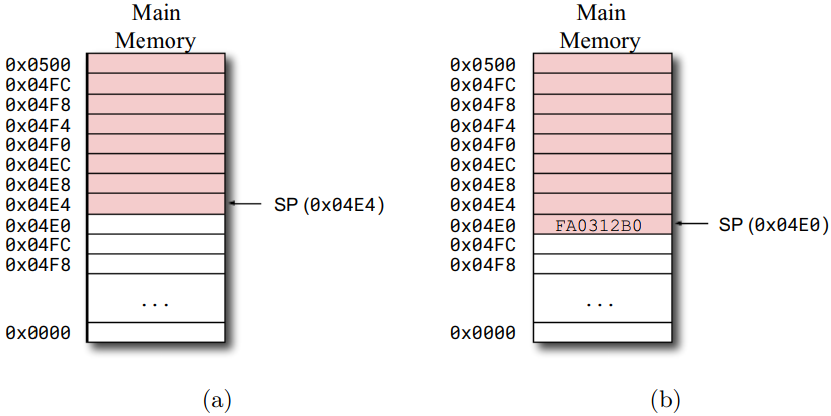

# 8.1 内存布局

**存储程序**（stored-program）计算机体系结构是一种在内存中同时存储数据和代码的计算机体系结构。**冯·依曼架构**是一种计算机体系结构，它将数据和代码存储在同一个地址空间中。大多数现代计算机结构都是冯·诺依曼架构。

图8.1展示了在冯·诺依曼架构的内存上组织程序的一种常见方式。

* **代码空间是存储程序代码的内存空间**，通常放低地址的开头。
* **静态数据空间是存储程序静态数据**（例如全局变量）的内存空间，放置在代码空间之后。
* **堆空间是由内存分配库管理的内存空间**，分配在静态数据空间之后。堆一开始很小，每当内存分配库需要更多空间时，它都会调用操作系统增大堆区域，这是通过增加 *程序中断*（program break，它定义了堆空间的结尾）地址来实现的。
* 最后，**栈空间是存储程序栈的内存空间**，通常放置在内存的末尾（即高地址）。


> 图8.1 


# 8.2 程序的栈

活跃例程（An active routine）是被调用但尚未返回的例程。请注意，在给定的执行点上可能有多个活动例程。

```c
int a = 10;

int main()
{
    return bar() + 2;
}
int bar()
{
    return fun() + 4;
}
int fun()
{
    return a;
}
```

例如下面的代码中，例程`fun`被例程`bar`调用，而`bar`被例程`main`调用。一开始`main`是活跃的，然后它调用`bar`，该例程也变为活跃状态。最后调用`fun`，它也变为活跃状态。此时系统中有3个活跃例程。

每当调用例程时，活跃例程的集合增加；每当例程返回时，活跃例程的集合减少。例程以后进先出的方式激活和停用，即最后一个被激活的例程必须是第一个被停用的例程。因此，**用于跟踪活跃例程的最自然的数据结构是栈**。

例程通常需要内存空间来存储重要信息，如局部变量、参数和返回地址。因此，每当调用一个例程（并进入活跃状态）时，系统需要分配内存空间来存储与该例程有关的信息。在它返回（停用）之后，与该例程调用相关的所有信息都不再需要了，内存空间必须被释放。

**程序栈是一个栈数据结构，存储了活跃例程的信息**，如局部变量、参数和返回地址。程序栈存储在主存中，每当调用例程时，有关例程的信息都会压入栈顶，这导致栈增长。而当例程返回时，将栈顶的内容删除后，有关例程的信息将被抛弃，这使得栈收缩。

程序栈是在**栈空间**中分配的，栈空间通常位于内存的末尾（即高位地址的地方）。因此，程序栈必须向低地址增长。

栈指针是一个指向栈顶的指针，它存储了栈顶的地址。通过调整栈指针可以使得程序栈增长或者收缩。

在RISC-V中，**栈指针由寄存器`sp`存储**。此外，在RISC-V中，栈向低地址增长，因此可以通过减小寄存器`sp`（栈指针）的值来增加（或分配）栈上的空间。下面的代码展示了如何将寄存器`a0`的内容压入栈中。首先，减小栈指针以分配空间（4字节），然后使用`sw`指令将寄存器`a0`（4字节）的内容存储在程序栈的顶部

```assembly
addi sp, sp, -4 # 分配栈空间
sw a0, 0(sp) 	# 将数据存储到栈
lw a0, 0(sp) 	# 从栈获取数据
addi sp, sp, 4 	# 回收栈空间
```

图8.2 (a)展示了一个程序栈，它从地址0x0500开始，一直延伸到地址0x04E4。因为栈指针指向栈顶，所以寄存器`sp`的内容等于0x04E4。

图8.2 (b)显示了程序栈在执行以下代码（即将寄存器a0的内容压入栈）之后是如何被修改的。注意栈指针`sp`的值减了4，而寄存器`a0` （0xFA0312B0）的值在内存地址为0x04E0的地方开始存储。



```assembly
li a0, 0xFA0312B0
addi sp, sp, -4 # 分配栈空间
sw a0, 0(sp) 	# 往栈中存储数据
```

前面的例子讨论了如何在栈中插入和弹出一个4字节的字（word）。在许多情况下，程序可能需要向栈中插入或弹出多个值。例如程序可能需要在栈上保存一组寄存器值。此时可以对代码进行优化，只调整（增加或减少）一次栈指针的值。下面展示了如何将4个值从寄存器`a0`、`a1`、`a2`和`a3`压入程序栈。注意栈指针只调整了一次，`sw`指令的参数中的立即数用于指定值在栈中的位置。在这个例子中，最后压入栈的是存储在寄存器`a3`中的值。

```assembly
addi sp, sp, -16 # 分配栈空间 (4个word)
sw a0, 12(sp) 	# 栈上存储第1个值 (SP+12)
sw a1, 8(sp) 	# 栈上存储第2个值 (SP+8)
sw a2, 4(sp) 	# 栈上存储第3个值 (SP+4)
sw a3, 0(sp) 	# 栈上存储第4个值 (SP+0)
```

下面的代码展示了如何将程序栈中的4个值弹出（pop）到寄存器`a3`、`a2`、`a1`和`a0`。注意栈指针只调整了一次，`lw`指令参数中的立即数用于指定被弹出的值的地址。在这个例子中，从栈弹出的第一个值存储在寄存器`a3`中。

```assembly
lw a3, 0(sp) 	# 从栈中获取第1个值 (SP+0)
lw a2, 4(sp) 	# 从栈中获取第2个值 (SP+4)
lw a1, 8(sp) 	# 从栈中获取第3个值 (SP+8)
lw a0, 12(sp) 	# 从栈中获取第4个值 (SP+12)
addi sp, sp, 16 # 回收栈空间
```

前面的例子展示了入栈和出栈的操作。出栈操作包含两步：弹出数据然后释放栈空间，但如果不再需要该数据，则只需要执行释放操作。正如我们将在8.6节和8.4节中讨论的那样，在很多情况下，分配或释放栈空间但不立即对栈空间进行读写操作是很有用的。


**初始化栈指针**

在执行程序之前，栈指针寄存器必须初始化为指向栈底。在没有操作系统支持的情况下（例如嵌入式系统中）运行程序时，**栈指针必须由系统初始化代码初始化。当程序在操作系统上运行时，执行环境（例如操作系统内核）通常会在跳转到程序入口点之前初始化栈指针**。


## 8.2.1 栈的类型

程序栈可以分为以下几种类型：满降序（full descending ）、满升序、空降序和空升序。

**满降序栈是这样一种栈：**

* 栈顶向低地址增长，
* 栈指针指向压入栈的最后一个元素。

将值压入一个满降序栈是通过减小栈指针值，然后将值存储到栈指针指向的内存字中（即栈顶）来实现的。而从一个满降序栈弹出一个值，首先要从栈顶加载值，然后增加栈指针的值。

**空降序栈是这样一种栈：**

* 栈顶向低地址增长，
* 栈指针指向下一个可用的内存位置（即栈顶指针必须指向这样一个位置，该位置用于存储下一个入栈的数据）。

将一个值压入一个空降序栈是这样进行的：首先将该值存储到栈指针指向的内存字（一个空闲的内存单元）中，然后递减栈指针。从一个空降序栈弹出一个值，首先是增加栈指针，然后从栈指针指向的内存字（即栈顶）加载该值。

**满升序栈是这样一种栈：**

* 栈顶指针向高地址增长
* 栈指针指向压入栈的最后一个元素。

将一个值压入一个满升序栈是通过增加栈指针，然后将值存储到栈指针指向的内存字中（即栈顶）来实现的。从一个满升序栈弹出一个值，首先要从栈顶加载值，然后减少栈指针的值。

**空升序栈是这样一种栈：**

* 栈顶向高地址增长，
* 栈指针指向下一个可用的内存位置（即栈顶指针必须指向这样一个位置，该位置用于存储下一个入栈的数据）。

将一个值压入一个空升序栈是这样进行的：首先将该值存储到栈指针指向的内存字（一个空闲的内存单元）中，然后增加栈指针。从一个空降序栈弹出一个值，首先是减少栈指针，然后从栈指针指向的内存字（即栈顶）加载该值。


> 注：RISC-V的程序栈是满降序的


# 8.3 ABI与软件构建（composition）

应用程序二进制接口（Application Binary Interface，简称ABI）是一组用来促进软件构建的约定。ABI定义了调用约定，调用约定规范了例程调用时候的参数传递和获取返回值的方法。

为了说明它的重要性，我们假设John实现了一个名为`jsort`的例程，它接受两个参数：一个指向字符数组的指针和一个表示数组大小的整数。下面的代码展示了`jsort`的签名:

```c
void jsort(char* a, int n);
```

另外，假设John通过二进制库提供了这个例程。

现在，假设Mary有John的库，并且想要调用`jsort`例程。到目前为止，我们知道Mary可以将她的程序与John的库链接起来，并通过执行`jal jsort`指令来调用`jsort`。然而，Mary应该将调用例程参数放在哪里，即指向数组的指针（`char* a`）和数组的大小（`int n`）。

上一个问题的答案是："这取决于John实现的代码对参数位置的期望"。例如，如果`jsort`期望将第一个参数（指向数组的指针）放置在寄存器`a0`，第二个参数（数组大小）放置在寄存器`a1`，那么，Mary必须将这些参数放置在这两个寄存器中，否则，John的代码将无法正常工作。

ABI定义了调用约定，调用约定定义了如何给例程传参。假设John和Mary遵循相同的ABI，那么Mary应该很容易将例程参数放在正确的寄存器中。

即使是单个计算机体系结构，也可能有多个不同的ABIs定义。对于x86来说就是这样，不同的操作系统定义了不同的abi。RISC-V联盟定义了几个ABIs。除非另有说明，否则在本文中，我们将使用RISC-V ilp32 ABI，它规定`int`、`long`和指针都是32位。它还定义了`long long`是64位，`char`8位，`short`16位。

> 注：只有为同一个ABI生成的代码可以通过链接器链接在一起。

> 注：在使用GCC生成代码时，用户可以使用`-mabi`选项指定ABI。例如，下面的命令可以使用ilp32 ABI对program.c文件进行编译和汇编：
>
> `gcc -c program.c -mabi=ilp32 -o program.o`


# 8.4 例程的传参与返回值

## 8.4.1 给例程传参

有些例程有参数，因此在调用它们时需要传参。例程的参数可以通过寄存器或程序栈传递。如8.3节所述，使用哪种方式向例程传递参数由ABI定义。

RISC-V ilp32 ABI定义了一组向例程传递参数的约定。这些约定指定了如何在寄存器或栈上传递不同类型（例如字符、整数、结构体等）的值。为简化讨论，我们只关注标量值，它们能用32位或更少的位表示。这些值可以是以下类型：

* `char`（有符号或无符号）
* `short`（有符号或无符号）
* `integer`（有符号或无符号）
* 指针

*整数调用约定（The integer calling convention）* 指定了以下规则，用于将上述类型的值作为参数传递。

* 例程的前8个标量参数通过寄存器`a0`~`a7`传递，每个寄存器一个参数。因此，如果例程的参数少于9个，则所有参数都通过寄存器传递。小于32位的类型（例如`char`或`short`）会使用符号扩展到32位。
* 如果有超过8个参数，则剩余的参数（即参数9到第N个参数）将通过堆栈传递。此时必须将参数压入程序栈。最后一个参数（即第N个参数）必须最先入栈，而第9个参数必须最后入栈。将参数压栈的例程，稍后必须将参数从栈中移除。同样，小于32位的类型（例如`char`或`short`）会使用符号扩展到32位。因此，小于32位的类型会扩展到32位，在传参时在栈中占4个字节。

在调用例程之前，调用者必须设置好参数，也就是说，参数必须根据ABI放在寄存器和栈中。为了说明如何传递参数，我们假设有一个名为`sum10`的例程，它接收10个整数值作为参数，并对它们求和，然后返回结果。下面的代码展示了`sum10`的签名：

```assembly
int sum10(int a, int b, int c, int d, int e,
          int f, int g, int h, int i, int j);
```

根据RISC-V ilp32 ABI，要调用这个例程，必须将参数`a`、`b`、`c`、`d`、`e`、`f`、`g`和`h`分别放在寄存器`a0`、`a1`、`a2`、`a3`、`a4`、`a5`、`a6`和`a7`上。此外，参数`i`和`j`必须放在栈上，因为`j`的值首先被压入，而`i`的值最后被压入。

下面的代码展示了如何调用`sum10`，并将值10、20、30、40、50、60、70、80、90、100作为参数传递。注意第9和第10个参数被压入栈（第11~15行）。另外，这些参数稍后会被将它们放在栈上的同一个例程（即`main`例程）从程序栈中删除（第17行）。

```assembly
# sum10(10,20,30,40,50,60,70,80,90,100);
main:
li a0, 10 # 第1个参数
li a1, 20 # 第2个参数
li a2, 30 # 第3个参数
li a3, 40 # 第4个参数
li a4, 50 # 第5个参数
li a5, 60 # 第6个参数
li a6, 70 # 第7个参数
li a7, 80 # 第8个参数
addi sp, sp, -8 # 分配栈空间
li t1, 100 # 第10个参数入栈
sw t1, 4(sp)
li t1, 90 # 第9个参数入栈
sw t1, 0(sp)
jal sum10 # 调用 sum10
addi sp, sp, 8 # 回收栈空间
ret
```

被调用的例程（本例中是`sum10`）必须根据ABI从寄存器和栈中获取参数。下面的代码展示了`sum10`的一种可能的实现，并说明了这个过程。它将堆栈中的第9个和第10个参数的值加载到寄存器`t1`和`t2`中。请注意，即使它从程序栈加载这些值，但不会从程序栈弹出（释放）这些值——清理的过程必须由调用者执行，即调用`sum10`的例程。

```assembly
sum10:
lw t1, 0(sp) # 将第9个参数加载到t1
lw t2, 4(sp) # 将第10个参数加载到t2
add a0, a0, a1 # 将所有参数累加
add a0, a0, a2
add a0, a0, a3
add a0, a0, a4
add a0, a0, a5
add a0, a0, a6
add a0, a0, a7
add a0, a0, t1
add a0, a0, t2 # 将返回值放到a0
ret # 返回
```


## 8.4.2 获取例程的返回值

RISC-V ilp32 ABI 规定，应将（返回）值存到寄存器`a0`中。如果返回值是64位长，则将低32位存到`a0`中，高32位存到`a1`中。


# 8.5 值和参数引用

> 本节讨论了两种不同类型的参数：
>
> 1. 值参数
> 2. 引用参数

参数可以作为值传递或作为变量的引用传递。**值参数（Value parameters  ）是通过值传递的参数，它包含了自身的值**，即将值直接放入寄存器或程序栈中。下面的代码演示了一个传参是值传递的例程。该例程接收一个值作为参数，计算其平方，并返回结果。

```c
int pow2(int v)
{
	return v*v;
}
```

根据RISC-V ilp32 ABI，这个参数必须在寄存器`a0`中传递。因为它是作为值传递的，所以`a0`将包含值本身。下面的代码用汇编语言实现了前面的C代码。注意，该代码将`a0`的值相乘。

```assembly
pow2:
	mul a0, a0, a0 # a0 = a0 * a0
	ret # 返回
```

下面的代码展示了如何调用`pow2`来计算32的平方。注意值本身直接放入寄存器`a0`中。

```assembly
main:
	li a0, 32 # 设置参数值为32
	jal pow2 # 调用pow2
	ret
```


Reference parameters are parameters that contain a reference to a variable. This “reference” is the variable memory address. Hence, the routine may use this address to read or update the variable value. The following code shows a routine that expects its parameter to be passed by reference. This routine updates the variable value by increasing its contents by one.

***引用参数*（Reference parameters）这样一种参数，它包含了指向变量的引用**。这个“引用”是变量的内存地址。因此，例程可以使用该地址来读取或更新变量的值。下面的代码显示了一个例程，它期望其参数通过引用传递。这个例程通过将变量的内容加1来更新变量的值。

```c
1 void inc(int* v)
2 {
3 *v = *v + 1;
4 }
```

同样，根据RISC-V ilp32 ABI，该参数必须在寄存器`a0`中传递。因为它是作为引用传递的，所以`a0`将包含该变量的地址。下面的代码用汇编语言实现了前面的C代码。请注意，代码使用`a0`中的地址来更新变量的内容。

```assembly
inc:
	lw a1, (a0) # a1 = *v
	addi a1, a1, 1 # a1 = a1 + 1
	sw a1, (a0) # *v = a1
	ret
```

下面的代码展示了如何调用`inc`例程来增加变量`y`的值。注意，变量是`y`的地址，而不是它的值，被加载到寄存器`a0`中。

```assembly
.data
y: .skip 4

.text
main:
	la a0, y # 将y的地址作为参数加载到a0中
	jal inc # 调用inc例程
	ret
```


*引用参数* 可用于把信息传入/传出例程。由于引用本质上是一个内存地址，所以传入/传出例程的信息肯定可以（通过引用）在内容中定位。

# 8.6 全局变量vs局部变量

在高级语言（如C语言）中，全局变量是在例程外部声明的变量，能被程序中的任何例程访问。

下面的代码展示了一个带有全局变量`x`的C语言程序。注意，可以在任何例程中访问这个全局变量。

```C
int x;

int main()
{
	return x+1;
}
```
汇编器将全局变量分配在静态数据空间上，在汇编代码中，通常借助汇编命令（directives）来声明全局变量。下面的代码显示了前面的C程序的汇编代码。

```assembly
.data
x:
	.skip 4

.text
main:
	la a0, x # 加载X的地址
	lw a0, 0(a0) # 加载x的值
	addi a0, a0, 1 # 增加a0的值
	ret # Return
```

在前面的代码中，`.data`指令（第1行）通知汇编器必须将后续的内容放到静态数据区中。标签`x`标记了变量`x`的地址。`.skip`指令（第3行）指示汇编程序跳过4个字节，这用于为变量`x`分配空间。`.text`命令（第5行）通知汇编器，后续的内容放置到代码空间中。剩余的代码（第6-10行）实现了主例程。

在高级语言中，比如C语言，局部变量是在例程中声明的变量，并且只能在声明它的例程中使用。

理想情况下，局部变量应该分配到寄存器上。下面的代码包含了一个名为`tmp`的局部变量，它可以分配到寄存器上。

```C
void exchange(int* a, int* b)
{
	int tmp = *b;
	*b = *a
	*a = tmp;
}
```
下面的代码显示了前面C语言代码的汇编代码。注意局部变量`tmp`是在寄存器`a2`上分配的。

```assembly
exchange:
	lw a2, (a1) # tmp = *b
	lw a3, (a0) # a3 = *a
	sw a3, (a1) # *b = a3
	sw a2, (a0) # *a = tmp
	ret
```


## 8.6.1 将局部变量分配到内存上

在以下几种情况中，局部变量必须分配在内存中：
* 当例程有大量的局部变量，但没有足够的寄存器来为它们分配空间。
* 局部变量是数组或者结构体。
* 当代码需要局部变量的地址。当将局部变量作为引用传递给其他例程时，可能会出现这种情况。
> 情况3为即一个例程需要用到另外一个例程的局部变量，此时变量通过引用传递，必须分配到内存中。因为分配到寄存器中是无法通过地址引用的。

需要在内存上分配的局部变量，会在调用例程时在栈上分配空间，并变为活跃（active）状态；在例程返回时栈空间被回收，变量变为不活跃状态。这些变量必须由包含它们的例程分配和释放空间，在例程进入时分配，在例程返回之前释放。

在程序栈分配空间，是通过减少栈指针的值实现的，减少的值为需要分配的字节数。下面的代码展示了一个名为`userid`的、需要在内存上分配的局部变量。该变量的地址是一个4字节的整数，会传递给例程`get_uid`。

```C
int foo()
{
	int userid;
	get_uid(&userid);
	return userid;
}
```
`
下面的代码展示了`foo`例程的汇编代码。
* 首先，减少栈指针的值来为变量`userid`分配空间（第2行）。
* 然后，将`userid`的地址加载到寄存器`a0`，作为参数传递给例程`get_uid`（第3行）。请注意，由于添加到程序栈的最后一个元素是`userid`，因此栈指针指向该元素。
* 接下来，调用`get_uid`例程（第4行），在返回之后，将`userid`变量的值加载到要返回的寄存器`a0`中（第5行）。
* 最后，在从`foo`例程返回之前，增加栈指针，以便从程序栈中释放`userid`变量。

```assembly
foo:
	addi sp, sp, -4 # 为userid分配栈空间
	mv a0, sp # a0的值是变量userid的地址 (&userid)
	jal get_uid # 调用get_uid
	lw a0, (sp) # a0 = userid
	addi sp, sp, 4 # 回收userid的栈空间
	ret
```

下面的代码展示了需要在内存中为局部变量分配空间的另一个例子。此时需要在内存上为局部变量`my_array`分配空间，因为它是一个数组。而该变量的地址会传递给例程`init_array`。

```C
int bar()
{
	int my_array[8];
	init_array(my_array);
	return my_array[4];
}
```
下面的代码显示了`bar`例程的汇编代码。
* 首先，减少栈指针，为变量`my_array`分配空间（第2行）。
* 然后，`my_array`的地址被加载到寄存器`a0`中，并作为参数传递给例程`init_array`（第3行）。由于添加到程序栈的最后一个元素是`my_array`，因此栈指针指向它。
* 接下来，调用`init_array`例程（第4行），在`init_array`返回之后，`my_array[4]`的值被加载到`a0`中以供返回（第5行）。
* 最后，在从`bar`返回之前，增加栈指针以释放`my_array`（第6行）。


下面的代码显示了另一个需要在内存中为局部变量分配空间的示例。在这种情况下，因为变量`d`是一个结构体，需要在内存中为其分配空间。然后，这个变量的地址被传递给例程`init_date`。

```C
typedef struct
{
	int year;
	int month;
	int day;
} date_t;

int get_current_day()
{
	date_t d;
	init_date(&d);
	return d.day;
}
```

下面的代码显示了`get_current_day`例程的汇编代码。

* 首先，减少栈指针，为变量`d`分配空间（第2行）。
* 然后，`d`的地址被加载到寄存器`a0`中，并作为参数传递给例程`init_date`（第3行）。由于压栈的最后一个元素是`d`，所以栈指针指向`d`。
* 接下来，调用`init_date`例程（第4行），返回后，将`d.day`的值加载到寄存器`a0`中以便返回（第5行）。
* 最后，在从`get_current_day`返回前，增加栈指针以从栈中释放`d`（第6行）。


```assembly
get_current_day:
	addi sp, sp, -12 # 给变量d分配栈空间
	mv a0, sp # 将d的地址存到a0中
	jal init_date # 调用init_date routine
	lw a0, 8(sp) # 将 d.day 加载到a0
	addi sp, sp, 12 # 回收栈空间
	ret
```

# 8.7 寄存器的使用策略

# 8.8 栈帧（Stack Frames）和帧指针

# 8.9 实现兼容RISC-V ilp32指令集的例程

# 8.10 示例

