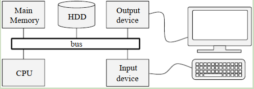
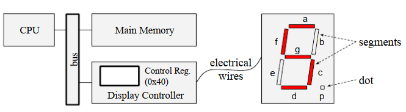
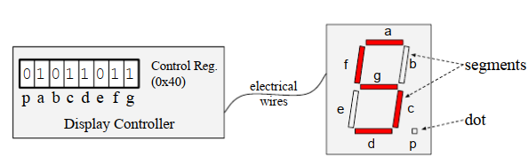
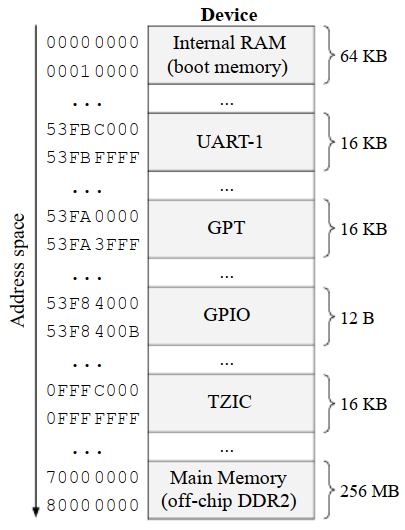

前几章讨论过，CPU执行存储在主存中的程序。在这个过程中，CPU从主存中获取程序指令并执行，这可能使得CPU在主存中加载或存储数据。前面的章节还解释了用户级程序通过调用操作系统（的接口）来执行输入和输出操作。

本章讨论程序如何直接与IO硬件设备交互来执行IO操作。在为不包含OS的系统开发软件，或实现OS组件（如设备驱动程序）时，这很有用。

本章剩下部分组织如下：
* 9.1节介绍了外设的概念，并讨论了外设与CPU的连接方式。
* 9.2节介绍了程序与外设交互的两种主要方法：端口映射I/O和内存映射I/O。
* 9.3节讨论了在基于RISCV的计算系统上如何执行I/O操作。
* 最后，9.3节讨论了忙等（Busy waiting）的概念。
  
# 9.1 外设

外设是连接到计算机的I/O设备。有若干种不同类型的外设。鼠标、键盘、图像扫描仪、条形码阅读器、游戏控制器、麦克风、网络摄像头和只读内存都是输入设备的例子。显示器、投影仪、打印机、耳机和计算机扬声器都是输出设备的例子。还有一些设备可以同时执行输入和输出操作，例如数据存储设备（包括磁盘驱动器、USB闪存驱动器、记忆卡和磁带驱动器）、网卡等。

IO设备通过总线与CPU通讯，总线是在计算机组件之间传输信息的通信系统。这种系统通常由负责传输信息的线路和协调通信的相关电路组成。图9.1展示了一个计算机系统，其中系统总线连接了CPU、主内存、持久话存储设备（HDD）、输入设备和输出设备。



> 图9.1

外设通常包含寄存器或内部存储，CPU通过访问这些寄存器或存储器来执行输入和输出操作。为讨论这个概念，让我们考虑一个假想的计算系统，它有一个七段数码管（一个输出外设）连接到显示控制器，显示控制器又通过总线连接到CPU，如图9.2所示。


> 图9.2

七段数码管是包含七个段（segment）和一个可以单独发光的点的设备。现代的七段数码管由七个LED（每个segment一个）和光点组成。segment和点被放置在显示器上，因此可以通过点亮一些segment来显示类似于十进制数字的图案。例如，我们可以打开a、f、g、c和d段，以显示类似于十进制数字5的图案，如图9.2所示。

显示控制器是负责控制七段数码管的装置。它使用电线连接到7个segment，并根据8位的控制寄存器的值打开或关闭每个segment和光点。控制寄存器的每个位控制每个segment或光点的打开和关闭。在本例中，第7、6、5、4、3、2、1和0位（最右边的位）分别控制光点和a、b、c、d、e、f、g这几个segment。图9.3展示了必须往控制寄存器写入0x5b这个值，才能显示类似于十进制数字5。


> 图9.3

在前面的例子中，七段数码管由显示控制器控制，该控制器根据控制寄存器的值，打开和关闭对应的segment和光点。在这种情况下，为了使用显示控制器执行输出操作，CPU必须将一个值写入显示控制器控制寄存器。一般来说，要使用I/O设备执行输出或输入操作，**CPU对设备的控制器中的寄存器或内部内存进行读写**。

下一节将讨论CPU如何读写外设的寄存器及其内部内存。

# 9.2 与外设交互

CPU通过在总线上发送地址、数据和命令与主存进行交互。例如，要将8位的值0x55写入地址为0x8000的内存中，CPU可以通过总线将写操作命令、地址和值发送到主内存。而从内存中读数据，CPU可以发送读操作命令和内存地址，并且等待主存把数据放在总线上，然后它把数据复制到它的内部寄存器中。CPU使用相同的方法与外设的控制器交互，即CPU通过总线，向控制器发送/接收信息、命令、地址和数据。

CPU通常通过一个或多个总线物理地连接到主内存和外设控制器。总线有很多种，它们的组织和实现可能差别很大。例如，一些总线可能使用同一组线路来传输地址、数据和命令，而另一些总线可能使用专用线路来完成这些操作。此外，总线的数量及其在系统上的配置可能会因计算系统而有很大差异。

尽管总线的实现和组织可能差异很大，但它们的特性通常对程序员是透明的，即它们不会影响程序员如何生成与外设控制器或主内存交互的代码。CPU ISA通常给程序员提供一些指令，隐藏了CPU、外设、总线之间如何交互的细节（例如，它们的协议和内部工作原理）。这些指令允许程序员让CPU以一种简单的方式对外设的寄存器及其内部存储进行IO。例如，RV32I ISA包含加载和存储指令（例如，`lw`和`sw1`），允许程序员指示CPU对主存进行IO，而无需考虑连接CPU和主存的总线是如何工作的。

系统上可能有几个外设，每个外设可能有多个寄存器或内部存储。因此，程序员必须有一种方法来指定汇编指令要访问的（外设的）寄存器或内存。这通常是通过将每个外设寄存器和内存**关联到不同的标识符**（通常是一个整数）来完成的，**这个标识符就是地址或I/O端口**。在这种情况下，用于与外设交互的指令，通常通过**自身的地址或I/O端口**，来标识外设的寄存器或内存地址。

9.2.1节和9.2.2节会讨论通过执行CPU指令来访问外设寄存器及其内部内存的两种主要方法。


## 9.2.1 端口映射I/O（Port-mapped I/O）
端口映射I/O，也称为隔离I/O，是一种访问外设寄存器及其内部存储的方法（这些寄存器和内部存储需要用特殊的ISA指令进行I/O操作）。这种方法有两个核心概念：I/O端口和I/O指令。
* I/O指令是一种专用于访问外设的特殊指令。
* I/O端口是一个无符号整数，用于标识外设的寄存器和内部存储的地址。

程序员使用这个标识符来指定，在用I/O指令执行I/O操作时，必须访问哪些外设寄存器或内部存储。

为说明这个概念，我们考虑Intel的IA-32指令集。它包含两个I/O指令，用于在CPU寄存器和外设寄存器或内部存储之间复制数据，分别是从"从端口输入"（`in`指令）和"输出到端口"（`out`指令）。

`in`指令需要两个参数：I/O端口和目标寄存器（即`al`/`ax`/`eax`寄存器）。该指令从外设的寄存器、或被I/O端口指定的内部存储中，复制一个值到CPU的目标寄存器中。下面的代码展示了使用`in`指令从外设的I/O端口0x71中读取一个8位的值，然后复制到CPU的`al`寄存器中。

```assembly
in 0x71, %al
```

`out`指令也需要两个操作数。第一个指定了目标I/O端口，第二个指定了源CPU寄存器。`out`指令将源CPU寄存器中的值，复制到外设寄存器或内部存储（由I/O端口操作数标识）中。下面的代码展示了使用`out`指令将存储在CPU `al`寄存器中的8位值，写入由I/O端口0x70标识的外部寄存器（或内部存储）中。

```assembly
out %al, 0x70
```

## 9.2.2 内存映射I/O（Memory-mapped I/O）

I/O地址空间定义了有效的I/O端口的集合。例如在IA-32中，I/O地址空间由$2^{16}$（即64KB）个16位的、可独立寻址的端口组成，端口号从0到0xFFFF。端口映射的I/O地址空间与主存地址空间是不同的。即主存的一个内存地址（例如0x70），可以与映射到外设寄存器的I/O端口（例如0x70），具有相同的值。

**内存映射I/O，是一种使用常规内存访问指令访问外设寄存器及其内部存储的方法**。在内存映射I/O中，只有一个地址空间，这个空间的一部分映射到主存，另一部分映射到外设寄存器和内部存储。在这种情况下，从主存读取/写入数据的指令（例如，load和store指令），同样适用于从外设寄存器及其内部存储中读取/写入数据。地址定义了是访问主存，还是访问外设的寄存器和内部内存。图9.4展示了真实的计算系统上映射到主存和多个外设的地址空间。地址0x70000000到0x80000000映射到主存；因此，对这些地址进行load/store操作，会使得CPU在主存中读写数据。而对地址0x53F84000执行load/store操作，会使得CPU对GPIO外设上的寄存器读写数据。


> 图9.4


# 9.3 RISC-V上的IO操作

# 9.4 忙等（Busy waiting）

